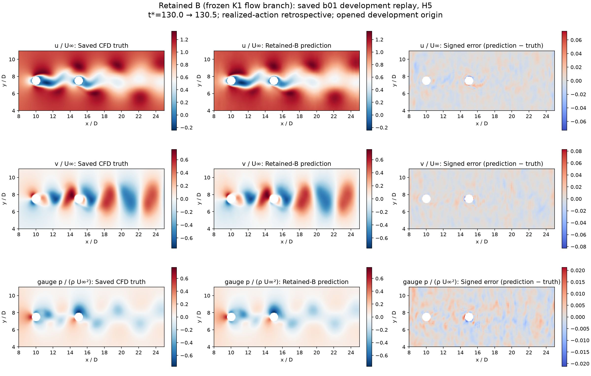

# FluidControl · 串列双圆柱主动流动控制

利用真实 CFD 数据训练流场与受力代理模型，在代理环境中训练强化学习策略，再将固定策略接入 OpenFOAM，形成反馈控制闭环。目标是降低两圆柱的总平均阻力，同时限制后圆柱升力波动和平均侧向力。

**已完成限定工况的基本 PPO–CFD 闭环：总平均阻力降低 4.13%，后圆柱升力波动降低 17.92%。完整代理预测精度仍未达标，MPC 暂未取得有效减阻收益。** 这些是数值仿真结果，不是风洞或实物控制结果。

## 物理场景与技术路线

研究对象为两个固定中心的串列圆柱，雷诺数 Re=100，中心间距 L/D=5。前圆柱不转，仅控制后圆柱转速；不涉及结构运动或涡激振动求解。

```text
OpenFOAM 生成真实流场与圆柱受力
  → PhysicsNeMo Curator / 官方 Reader + 项目 DataPipe 整理数据
  → PhysicsNeMo 官方双 FNO：流场预测、受力预测
  → HydroGym 接口 + 项目 FNO 推进器：构建训练环境
  → Stable-Baselines3 PPO：学习旋转控制策略
  → 固定 CPU 策略 + 真实 OpenFOAM：在线数值反馈验证
```

训练期间 FNO 保持固定，每段从真实 CFD 状态开始，连续预测 5 步供 PPO 学习。验证期间策略读取真实 CFD 观测，每隔 0.1 D/U∞ 调整一次转速；**不在线调用 FNO，不继续训练 PPO，也不是 MPC 控制**。HydroGym 提供训练环境接口，OpenFOAM 接入、奖励及动作限制由项目程序实现。

## 主要评估结果

已保存实验的最新汇总日期为 **2026-10-07**，本次文档整理未新增科学实验。默认模型为保留的 B 双 FNO，默认策略为 E082 canonical PPO，不以最新训练候选替换已验证版本。

| 验证 | 结果 | 结论 |
|---|---|---|
| E114 真实 CFD 闭环，800 个反馈周期，t*=328–408 | 总平均减阻 **4.1326%**；后柱升力波动降低 **17.9229%**；平均升力偏置 **1.2352%** | 主窗口及四个连续子窗口通过原物理标准 |
| E095 基本闭环复现，800 个反馈周期；主评估窗 t*=150–210 | 减阻 **4.0091%**；波动降低 **18.2810%**；偏置 **3.6366%** | 已完成真实 CFD 复现 |
| B FNO 完整预测评估 | 验证集 100 步末端速度相对 L2 误差 **4.36%**；6 个受力统计分支仅 **2/6** 同时达标 | 控制成功不等于代理精度充分 |
| B-FNO H5 MPC，10 个反馈周期 | 配对减阻 **−0.0079%**，即轻微增阻 | 短时流程已运行，未证明有效控制 |
| Representative256 候选，同精度固定六窗口比较 | 单步误差增加 **15.82%**；连续 100 步误差增加 **14.27%** | 候选未采用，保留 B |

物理标准为减阻 ≥2%，后柱去均值升力 RMS 不超过对照的 105%，平均升力偏置不超过对照波动尺度的 10%。偏置列按最后一种尺度归一化，**不是相对平均升力的百分比**；预测误差变化也不是物理减阻。[指标定义和评估数据](research_records/RESULTS.md)


曲线来自 E114 受控与无旋转配对 CFD，展示总阻力、后柱升力及旋转动作。



图为一个已保存样例的 CFD、FNO 五步预测及误差分布，不代表完整预测验收通过。

## 当前结论与后续重点

基本流程已贯通，在当前 Re 与几何下验证了减阻和升力波动改善。E114 是同一策略、同一工况的延长时段，不构成跨工况泛化或独立统计重复。目前不宣称净节能、硬实时控制、风洞迁移或完整研究目标完成。

下一阶段保留已验证 PPO 闭环作为对照，优先改进控制相关受力预测与连续预测稳定性，再按相同评价方法验证 MPC 或新策略。论文级结论还需网格/时间步独立性、简单控制基线、重复试验及执行器能耗分析。

## 核心文档

| 文档 | 内容 |
|---|---|
| [总体技术方案](guide/OVERVIEW.md) | 目标、软件分工、分阶段实施路线 |
| [代理模型与训练](guide/TRAINING.md) | FNO 结构、输入输出、数据与有效训练参数 |
| [HydroGym 与控制实现](guide/CONTROL.md) | 观测、动作、奖励、PPO 和 MPC 的实际用法 |
| [评估结果](research_records/RESULTS.md) | 成功与失败结果、指标定义、图片及证据 |
| [复现指南](guide/REPRODUCTION.md) | 环境、模型索引、预检和必要数据 |

## 仓库结构与使用范围

| 路径 | 用途 |
|---|---|
| `cfd/tandem_cylinders/` | OpenFOAM 工况构建与[CFD 配置说明](cfd/tandem_cylinders/CASE_SPEC.md) |
| `src/fluid_control/`、`scripts/`、`conf/` | 数据、训练、评价及控制程序与配置 |
| `guide/` | 主要阅读文档 |
| `research_records/` | 精简的评估结果、模型索引及关键图片 |
| `reproducibility/` | 被程序或固定配置引用的原始文件；不作为阅读材料 |
| `docs` | 指向 `reproducibility/` 的兼容链接，保留已有程序查找路径 |
| `experiments/results.csv` | 结构化实验账本 |

Git 保存代码、配置及报告，**不包含全部 CFD/HDF5 数据和模型权重**。已验证环境与大文件在 DGX Spark；首次 clone 不是一键复现。Linux/Spark checkout 应保留 `docs` 符号链接，勿转成普通文本文件。[完整依赖和安全预检](guide/REPRODUCTION.md)

旧计划、进度快照和完整历史报告见 [research-history-20261009](https://github.com/jkrescue/FluidControl/tree/research-history-20261009/research_records)。主分支不再保留这些重复阅读材料。
