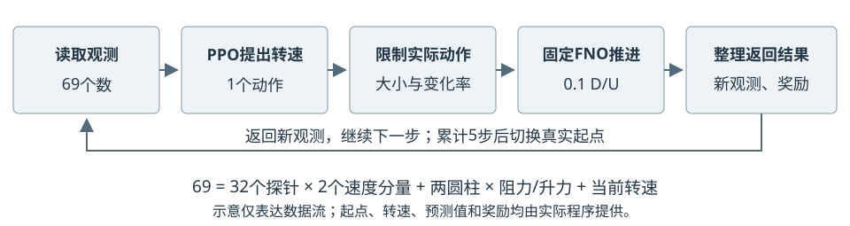

# HydroGym在双圆柱流动控制项目中的应用

2026年10月7日 · 图文说明

## 一、平台作用与项目分工

**HydroGym把流动计算组织成控制算法可以反复交互的环境。** 控制算法提出动作，环境推进一段流动，返回新的观测和评价分数，算法再据此调整控制策略。这里的“环境”不是安装软件的虚拟环境，而是供控制算法交互的流动系统。

HydroGym是面向流动建模与控制的开源平台，提供标准环境接口，也包含流动算例和求解器后端。不能将整个平台简单理解成一个接口。但在本项目中，实际使用的核心是它的`FlowEnv`环境接口；推进流动的是我们接入的FNO代理，而不是直接运行HydroGym自带的流动算例。[1]

图1为软件关系示意，不是流场计算结果。FNO是学习流动演化的预测网络；PPO是学习控制动作的强化学习算法。二者不是同一个模型。

| 部分 | 在本项目中的具体职责 |
|---|---|
| OpenFOAM | 求解速度、压力和圆柱受力；产生数据并验证控制效果 |
| PhysicsNeMo FNO | 根据当前流场和转速，预测下一时刻的流场与受力 |
| HydroGym | 提供环境交互接口，组织开始、推进和返回结果 |
| Stable-Baselines3 PPO | 收集交互记录，更新决定转速的控制策略 |
| 项目接入程序 | 定义双圆柱状态、观测、动作限制、奖励和数据记录 |

我们采用两个中心位置固定的串联圆柱，前柱不转，后柱可以旋转。HydroGym并不会自动知道应当减阻，也不会自动生成这个双圆柱案例；需要将上述物理状态和控制目标接入环境。

<!-- pagebreak -->

## 二、一次训练交互的完整过程

**开始一段交互时，先恢复一个已有CFD状态。** `reset()`表示重置环境：读取起始流场、实际转速及过去的受力记录，形成策略的第一次观测。它不是重新训练FNO，也不是把所有速度清零。本项目训练使用24个已验证的真实起点轮换开始。

**观测。** PPO每次接收69个数：32个探针位置各有两个速度分量，共64个；再加前、后圆柱各自的阻力与升力系数，共4个；最后是当前转速。阻力沿来流方向，升力垂直来流方向。这里不存在额外的“四力”物理概念。

**动作。** PPO输出后圆柱的请求转速。项目程序先限制转速大小和相邻动作变化，再把实际动作交给代理模型。当前限制为无量纲角速度绝对值不超过0.75，每次变化不超过0.1；角速度按“物理角速度×直径÷来流速度”定义。

**推进。** 两个固定的FNO分别预测下一流场和圆柱受力；从新流场提取探针速度，构成下一次69维观测。一次`step(action)`推进0.1个对流时间单位，即来流经过0.1个圆柱直径所需的物理时间，不是计算机耗时0.1秒。[2]

**奖励。** 奖励是供PPO学习的一个数。项目鼓励总阻力下降，并惩罚减阻不足、后柱升力波动过大、平均升力偏置过大以及过大的转速和动作变化。奖励由项目代码定义，HydroGym不会自动替我们选择目标。

升力波动需要一段历史，不能只看一个瞬时值。因此环境保留62个受力采样点，用于计算均值和波动；每预测一步，就用新预测值替换最旧点。最初这些历史点来自真实CFD，之后逐步加入预测值，不读取未来真值。它们不是FNO的62帧输入，也不额外加入PPO的69个观测数。

完成一步后，环境返回“新观测、奖励、是否结束、辅助记录”。达到当前设置的5步长度时结束这一小段，换一个真实起点继续；这是训练长度限制，不代表控制成功或流动已经稳定。

<!-- pagebreak -->

## 三、实际训练、闭环验证与当前结果

### 1. 在代理环境中训练控制策略

一次交互只产生一条经验，不会立即把所有网络训练一遍。本项目每收集512条交互记录，PPO再分批重复学习4遍，完成8次参数更新。整个已部署策略的训练共32,768条交互、64轮采集和512次优化器更新。此阶段FNO保持固定，学习的是PPO控制策略。

训练使用4个环境实例，每个实例轮换6个起点，共24个起点。这4个实例在一个进程中依次推进，不等于4块GPU并行。每段只预测5步，有助于限制代理误差累积和训练成本，但不能证明长时间预测准确。

### 2. 将已训练策略交给真实CFD验证

训练后固定PPO参数，在CPU上读取OpenFOAM计算的69个观测数，给出后柱转速，再让OpenFOAM推进20个求解时间步，取得下一次观测。这样不断重复，形成真实CFD反馈闭环；同时运行无旋转对照，检验受力改善。

**当前成功的验证循环由项目OpenFOAM连接程序执行，不依赖在线调用HydroGym的FNO代理环境。** FNO和PPO都不在验证时继续学习，也不是MPC在线选择动作。HydroGym的主要贡献发生在前面的策略训练阶段：将代理模型变成PPO可以规范交互的环境。

### 3. 已有成果与适用范围

在雷诺数100、间距比5的同一工况下，保留策略新增800个反馈周期的验证得到：两柱总平均阻力降低4.13%，后柱去均值升力波动降低17.92%，平均升力偏置为对照波动尺度的1.24%。这些数值来自OpenFOAM验证，不是HydroGym中的训练奖励。

完整代理预测精度仍未达标，MPC也尚未证明有效减阻。因此，接通HydroGym并完成PPO训练，只说明训练流程已经建立；控制效果仍须由CFD独立验证，不能推广为跨工况有效、硬实时控制或净节能。

### 资料来源

[1] [HydroGym官方项目](https://github.com/dynamicslab/hydrogym)。平台概述与项目实际使用范围分开说明，不将最新版全部功能视为本项目已使用能力。

[2] [项目固定版本的FlowEnv源码](https://github.com/dynamicslab/hydrogym/blob/4ab9854dea3d84e38a59c25e0f5835a00cf8225f/hydrogym/core.py)；[项目技术栈说明](TECHNICAL_DESIGN_DATA_STACK_20261007.md)、[E082训练核查](P064_B_SYMMETRY_CANONICAL_PPO_TERMINAL_REVIEW_20261007.md)、[E114闭环验证](P064_B_CONTINUATION_328_408_TERMINAL_REVIEW_20261007.md)。图示省略坐标对称变换、文件校验等工程细节；精确实现以这些记录为准。

### 一次控制策略的练习与验证

研究人员想让后圆柱自动调整转速，于是先准备CFD起始状态、训练好的FNO和评分规则，把它们接入HydroGym。PPO读到流动观测，提出一个转速；环境程序限制动作，再调用FNO预测后果，返回新观测和得分。这样反复练习，PPO根据积累的记录学习更合适的动作，HydroGym负责把每次练习组织起来。

练习结束后，研究人员固定PPO策略，把它交给OpenFOAM验证。策略仍然根据观测调整转速，但这次反馈来自实际CFD求解，不再来自FNO预测。只有与无旋转对照比较后，才能判断减阻和升力波动是否真的改善。HydroGym帮助组织了训练，却不能替代这场验证；代理预测有误，练习得分高也可能控制不好。
