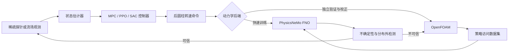

# PhysicsNeMo–HydroGym 闭环流动控制研究路线

更新日期：2026-10-01

## 1. 研究定位

本项目下一阶段研究串列双圆柱尾流的实时闭环控制。核心问题不是单独训练一个 PPO 策略，而是研究如何让数据驱动代理模型安全、可靠地参与高保真 CFD 闭环控制。

拟定主线为：

> **面向串列双圆柱尾流的、不确定性感知多保真闭环控制：PhysicsNeMo 神经算子、HydroGym 接口与 OpenFOAM 校正。**

三部分职责如下：

| 组件 | 职责 | 不能替代的部分 |
| --- | --- | --- |
| OpenFOAM | 生成高保真训练数据；执行独立闭环回放；给出最终物理结论 | 计算成本高，不适合直接承担全部策略探索 |
| PhysicsNeMo FNO | 预测动作条件下的短期流场和受力；支持快速 rollout、MPC 和策略训练 | 代理内部收益不能直接视为 CFD 控制效果 |
| HydroGym | 提供 Gymnasium 兼容的流体控制接口、标准环境、探针观测和 RL 基准 | 当前官方后端不包含 OpenFOAM，也不原生包含本项目串列双圆柱工况 |

HydroGym 官方仓库当前提供 6 类求解器后端、圆柱与旋转圆柱环境、探针观测、ParaView 输出，以及 Stable-Baselines3 等标准 RL 工具的接入示例。官方 [README](https://github.com/dynamicslab/hydrogym) 与[在线文档](https://dynamicslab.github.io/hydrogym/docs/quickstart/) 对环境数量的统计暂不一致，因此实验必须固定 HydroGym commit、容器和环境配置。

## 2. 核心科学问题

### 2.1 代理模型能否用于闭环决策

当前 FNO 在独立测试轨迹上保持稳定，但 100 步受力 MAE 仍达到 `0.2172`。强化学习会主动搜索高收益动作，可能利用代理误差获得虚假收益。因此，论文必须测量并控制以下差距：

```text
surrogate policy return
        ↓ OpenFOAM replay
high-fidelity policy return
        ↓ medium-grid replay
numerically verified policy return
```

仅在代理环境内取得较高 reward 不构成闭环控制结论。

### 2.2 如何减少高保真 CFD 交互

研究重点是让代理模型承担大部分策略探索，并只在不确定性高、动作超出数据支持或预测分歧大的状态调用 OpenFOAM。需要回答：

1. 相比直接 CFD 强化学习，可减少多少 OpenFOAM 交互和 GPU/CPU 小时；
2. 减少计算后，控制效果与稳定性损失是多少；
3. 新增 CFD 数据是否集中在策略实际访问的状态，而不是继续均匀扩充数据。

### 2.3 控制器能否跨工况泛化

固定 `Re=100、L/D=5` 的单工况策略只适合作为复现基线。具有论文价值的目标是让策略在未见来流速度、Reynolds 数、圆柱间距或扰动下保持性能，并用少量高保真样本完成适配。

### 2.4 全场控制能否转化为稀疏传感器控制

当前 FNO 使用完整 `u/v/p` 场，无法直接对应实验在线控制。研究应分三级观测：

1. 全场观测：算法上界和调试基准；
2. 32 个速度探针加 `Cd/Cl`：与参考论文和 HydroGym 探针接口对齐；
3. 更少探针或仅表面压力：用 POD、可观测性或学习方法选择传感器。

## 3. 闭环系统设计



### 3.1 环境接口

环境遵循 HydroGym 使用的 Gymnasium 语义：

```text
observation = 当前或历史探针、受力、控制量
action      = 归一化后圆柱转速命令，范围 [-1, 1]
step        = 推进一个控制周期，返回 observation/reward/terminated/truncated/info
```

动作映射保留物理上限、转速变化率和加速度约束。第一版先使用单执行器；多执行器只有在加入前圆柱旋转、吹吸或结构自由度后再引入。

HydroGym 已提供标准 `FlowEnv`/Gymnasium 接口和 PPO 示例，见[核心 API](https://dynamicslab.github.io/hydrogym/docs/api/core/)与[快速入门](https://dynamicslab.github.io/hydrogym/docs/quickstart/)。本项目只实现连接现有 FNO、OpenFOAM 与串列双圆柱观测的薄适配层，不重写 PPO、SAC、环境包装器或日志系统。

### 3.2 多目标控制指标

控制目标采用可分解的物理量，不以单个加权 reward 代替结果报告：

```text
J = mean(Cd_front + Cd_rear)
  + lambda_lift  * RMS(Cl_rear)
  + lambda_power * mean(omega^2)
  + lambda_rate  * mean((Delta omega)^2)
```

主报告指标：

- 总平均阻力和前、后柱平均阻力；
- 后柱 `Cl RMS`、最大 `|Cl|` 和主频幅值；
- 控制能耗代理 `mean(omega²)`；
- 动作变化率、约束违反和闭环稳定性；
- 推理延迟、CFD 交互次数和总计算成本；
- 各目标之间的 Pareto 前沿。

## 4. 论文级方法与基线

### 4.1 主方法

主方法采用不确定性感知的多保真训练：

1. 使用现有 PhysicsNeMo FNO 初始化快速环境；
2. 在代理环境中并行训练策略或执行可微 MPC；
3. 用模型集成分歧、rollout 误差预测或动作覆盖距离评估可信度；
4. 对高不确定性片段调用 OpenFOAM；
5. 将新增轨迹经 Curator 和 DataPipe 加入数据集；
6. 更新代理并重新评估策略，直到 CFD 控制指标收敛。

这一路线把当前 100 步误差和策略分布偏移转化为明确研究问题，而不是隐藏模型局限。

### 4.2 必须比较的基线

| 类别 | 基线 |
| --- | --- |
| 无控制 | `omega=0` |
| 开环 | 最优恒定转速、正弦动作、离线优化动作 |
| 模型预测控制 | PhysicsNeMo FNO 上的受约束 MPC |
| 强化学习 | PPO；连续动作 SAC 或 TQC 至少一种 |
| 高保真强化学习 | HydroGym 原生旋转圆柱环境的 PPO 基准；条件允许时执行少量 OpenFOAM 直接训练 |
| 主方法 | 代理预训练 + 不确定性门控 OpenFOAM 校正 |

HydroGym 原生旋转圆柱环境用于验证训练代码和外部基准，不应被描述为本项目串列双圆柱 OpenFOAM 环境。官方平台支持 Gymnasium、探针观测和 Stable-Baselines3，相关能力见[项目仓库](https://github.com/dynamicslab/hydrogym)。

## 5. 实验矩阵

### 5.1 第一层：方法闭环

- 工况：`Re=100、L/D=5`；
- 观测：完整流场与 32 探针分别训练；
- 动作：后柱连续旋转，包含幅值和变化率约束；
- 比较：无控制、开环、MPC、PPO/SAC、多保真方法；
- 验证：代理、粗网格 OpenFOAM、中网格 OpenFOAM 三级结果。

### 5.2 第二层：泛化与鲁棒性

- 训练工况：至少 3 个 Reynolds 数或来流速度、3 个 `L/D`；
- 测试工况：位于训练点之间和之外的未见参数；
- 扰动：入口速度扰动、观测噪声、执行器延迟、模型参数偏差；
- 结果：零样本、少样本适配和重新训练三种成本对比。

### 5.3 第三层：稀疏感知

- 全场、32 探针、8–16 个优化探针、表面压力四组观测；
- 前馈策略与含历史的 GRU/Transformer 策略对比；
- 报告控制性能、观测维度、噪声鲁棒性和实时延迟。

每个 RL 结果至少使用 5 个随机种子，报告均值、置信区间和最差种子；策略选择只使用 validation 工况，test 工况仅执行冻结策略。

## 6. 分阶段执行与门槛

### 阶段 A：冻结可信动力学代理

1. 完成有／无 teacher forcing 的受控消融；
2. 执行动作打乱、动作置零和反号测试，确认模型确实使用转速条件；
3. 在不同 `|omega|`、`|Delta omega|` 与 rollout 长度上分桶报告误差；
4. 建立代理不确定性评分，并校准其与 OpenFOAM 误差的关系。

门槛：动作敏感性显著高于模型随机波动；高不确定性分桶确实对应更高预测误差。

截至 2026-10-01，阶段 A 已完成。无 teacher forcing 模型在独立 test 的 10/50/100 步流场 MAE 相对课程式 teacher forcing 分别降低 10.04%/15.03%/19.40%，对应受力 MAE 降低 5.85%/21.43%/18.72%，全部 rollout 稳定。将转速置零、反号或打乱后，100 步流场 MAE 增加 190.52%–386.74%，受力 MAE 增加 746.57%–1433.23%，动作敏感性门槛已通过。密集起点分桶显示，100 步 `max |omega|∈[4,5)` 相对 `[2,3)` 的流场和受力 MAE 分别增加 64.61% 和 166.67%；50 步 `max |domega/dt|∈[4,6)` 相对 `[0,1)` 分别增加 122.86% 和 239.73%。高动作幅值和快速变化区应进入不确定性保护范围。

异构 checkpoint 委员会在 validation 上确定90%阈值，在独立 test 上得到10/50步流场分歧与真实误差秩相关 `0.950/0.889`；被标记窗口的流场误差为可信窗口的 `2.18/2.17` 倍。受力分歧秩相关仅约 `0.33`，但标记窗口的受力误差仍为可信窗口的 `4.30/1.99` 倍。该委员会可用于第一版门控诊断；正式概率不确定性仍需要同目标、不同随机种子的深度集成。

HydroGym 阶段已于 2026-10-01 启动，官方源码固定在 commit `4ab9854dea3d84e38a59c25e0f5835a00cf8225f`。Firedrake `Re=100` 旋转圆柱环境 smoke 与 256 步 PPO 链路验证已经完成，均正常退出。环境使用官方 `FlowEnv`、`RotaryCylinder`、`SemiImplicitBDF` 和 Stable-Baselines3 示例；结果见 `results/hydrogym_baseline_20261001/README.md`。

### 阶段 B：HydroGym 基准与环境适配

1. 固定 HydroGym commit 和 Firedrake 容器；
2. 复跑官方旋转圆柱 PPO 示例，记录 reward、物理指标和成本；
3. 实现串列双圆柱的 Gymnasium 薄适配层；
4. 用同一策略 API 切换 PhysicsNeMo 与 OpenFOAM 后端；
5. 用随机动作验证两个后端的单位、时间步、动作符号和 reward 分量。

门槛：相同动作序列可在两个后端完整回放；日志中每项 reward 都能还原为物理量。

截至 2026-10-01，前两项的软件链路验证已经完成。PPO smoke 使用 50 个压力探针，完成 256 个环境步和 4 次 rollout，约 55 秒；最终 `explained_variance=0.787`。等长 200 步物理审计显示，冻结 PPO 相比零动作的平均 `Cd` 增加 0.19%，`Cl RMS` 增加 7.41%，因此没有控制收益。HydroGym 当前默认 reward 仅为 `-dt × Cd`，没有升力波动和控制能耗项；正式训练前需要先定义与论文目标一致且可逐项审计的 reward。

### 阶段 C：控制基线

1. 先完成受约束 MPC，确定可达到的代理控制上界；
2. 训练 PPO 和 SAC/TQC；
3. 将冻结策略回放到独立 OpenFOAM；
4. 对策略利用造成的 surrogate-to-CFD gap 做定量分析。

门槛：中等网格 OpenFOAM 中的 `Cl RMS` 或阻力优于无控制与最优开环，同时不依赖约束违反。

截至 2026-10-01，受约束 PhysicsNeMo MPC 已形成第一版候选。动作按扩展数据 manifest 的 `max_abs_omega=5` 正确归一化后，30 步预测窗在 5 个不同代理初始状态上使后柱 `Cl RMS` 平均降低 9.47%，但 `Cd mean` 平均增加 6.66%。冻结动作 OpenFOAM 回放与代理的方向和量级一致。进一步完成的 100 步状态反馈 CFD 在每个控制周期使用最新流场重算动作：`t=80..90` 的 `Cl RMS` 降低 10.66%、`Cd mean` 增加 3.76%；去除过渡段后分别降低 15.87% 和增加 5.21%。状态反馈软件与物理方向门槛已经通过，阶段 C 仍需完成多个涡脱落周期、独立初始相位和中等网格验证。

### 阶段 D：多保真主动校正

1. 让不确定性门控选择 OpenFOAM 查询片段；
2. 与随机补数据、均匀补数据和全部 CFD 训练比较；
3. 统计达到相同控制性能所需的 CFD 轨迹数和计算小时；
4. 重复训练与冻结 test 回放，防止把主动采样的测试轨迹泄漏回训练集。

预注册目标：相对直接高保真探索减少至少 80% 的 CFD 交互，并将冻结 test 上的控制性能差距控制在 10% 以内。未达到该目标时仍完整报告样本效率曲线。

### 阶段 E：跨工况与稀疏观测

在阶段 D 通过后扩展 `Re/U∞/L/D`，再研究传感器压缩和策略适配。该阶段构成论文的泛化证据，不与基础环境调试同时展开。

## 7. 论文贡献与发表路线

优先形成一篇完整主论文，而不是把代理训练、PPO 和可视化拆成多个弱工作。拟定贡献为：

1. 动作条件 PhysicsNeMo 神经算子与串列双圆柱闭环环境；
2. 可在代理与 OpenFOAM 间切换的 HydroGym 兼容多保真接口；
3. 基于不确定性的策略访问数据采样与高保真校正；
4. 跨 Reynolds 数、圆柱间距与稀疏观测的鲁棒验证；
5. 公开可复现的 CFD、Curator、DataPipe、训练、控制和 ParaView 链路。

建议题目：

> **Uncertainty-Aware Multi-Fidelity Reinforcement Learning for Closed-Loop Control of Tandem-Cylinder Wakes with Neural Operators**

HydroGym 的 L4DC 2025 论文已将平台定位为流体控制强化学习基准，见 [PMLR 论文页面](https://proceedings.mlr.press/v283/lagemann25a.html)。因此，仅“在 HydroGym 中运行 PPO”创新性不足；可发表价值来自代理可信度、多保真样本效率、跨求解器验证和跨工况泛化。

潜在投稿方向按成果侧重点选择：

- 流体物理和控制证据充分：*Journal of Fluid Mechanics*、*Physics of Fluids*、*Ocean Engineering*；
- 学习控制和样本效率贡献突出：L4DC、CoRL、NeurIPS/ICLR 的科学机器学习相关方向；
- 第一篇完整工程复现：优先保证可重复、严格 CFD 回放和消融，再决定期刊层级。

## 8. 近期执行顺序

当前不立即大规模启动 RL。按以下顺序推进：

1. 冻结已完成的无 teacher forcing 代理版本；
2. 保留已完成的动作敏感性与不确定性校准作为安全门槛；
3. 以已通过的 HydroGym 旋转圆柱 smoke/PPO 链路为接口基线；
4. 完成零动作、随机动作和冻结策略的 reward 与物理量审计；
5. 实现 PhysicsNeMo/OpenFOAM 双后端环境适配和 reward 审计；
6. 先做 MPC，再做 PPO/SAC；
7. 所有候选策略回到独立中网格 OpenFOAM 回放；
8. 仅根据策略访问分布补充 CFD 数据；
9. 基础闭环通过后扩展跨来流、跨间距和稀疏传感器实验。

这一顺序可避免在代理仍可能忽略动作或低估长期误差时投入大量 RL 计算，也能让后续每一步直接服务于论文中的可检验假设。
