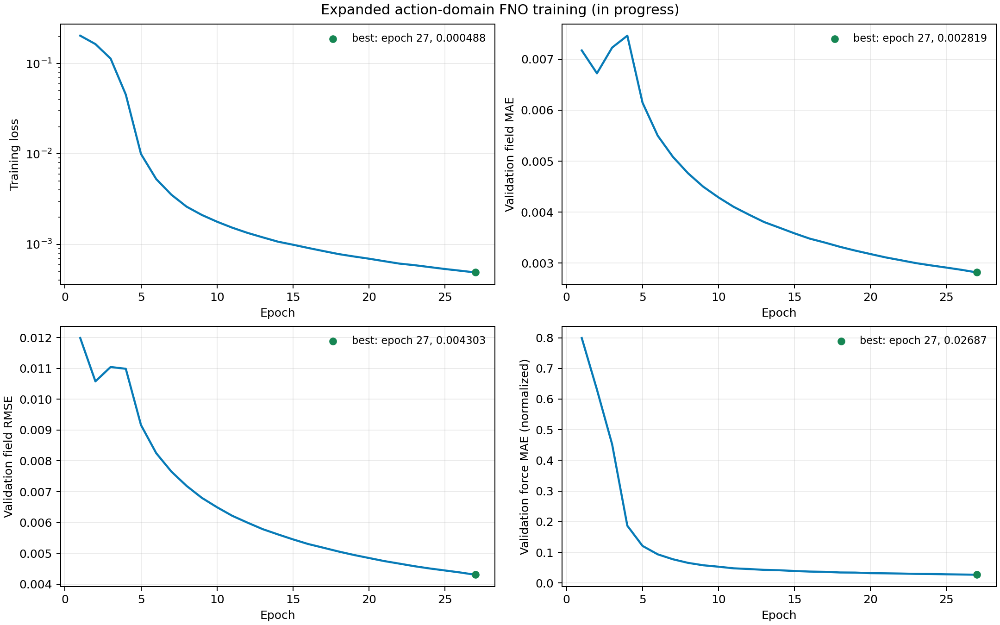

# 参考论文复现与 PhysicsNeMo 结果对照

## 参考文献

F. Zhao, Y. Zhou, F. Ren, H. Tang, and Z. Wang, “Mitigating the lift of a circular cylinder in wake flow using deep reinforcement learning guided self-rotation,” *Ocean Engineering*, vol. 306, 118138, 2024. DOI: [10.1016/j.oceaneng.2024.118138](https://doi.org/10.1016/j.oceaneng.2024.118138)。论文元数据与作者接受稿记录见 [PolyU Institutional Research Archive](https://ira.lib.polyu.edu.hk/handle/10397/107766)。

## 对照范围

参考论文采用传感器反馈、PPO 和后圆柱自转，直接与 CFD 环境交互以抑制后圆柱升力脉动。本项目当前阶段使用 OpenFOAM 生成受控流场，并训练 PhysicsNeMo FNO 预测给定转速下的流场和后圆柱受力。两者具有相同的代表性物理工况，但学习任务和评价指标不同。

| 项目 | 参考论文 | 当前实现 | 对照状态 |
| --- | --- | --- | --- |
| 基本流动 | 二维串列等直径圆柱，`Re=100` | 二维串列等直径圆柱，`Re=100` | 一致 |
| 计算域 | `30D × 15D` | `30D × 15D` | 一致 |
| 代表间距 | `L/D=5`，并研究其他间距 | `L/D=5` | 代表工况一致 |
| 执行器 | 后圆柱自转；表面速度比范围 `[-6,6]` | 代理训练与 CFD 数值验证覆盖 `q∈[-2.5,2.5]` | 机制一致，动作范围较窄 |
| 数值环境 | CUDA 加速 D2Q9 MRT 多块 LBM | OpenFOAM `pimpleFoam` 有限体积求解 | 独立数值实现 |
| 观测布置 | 后柱下游 `2D`、长度 `3D` 的竖直线，32 个等距速度传感器 | 原始 CFD 布置相同的 32 个探针；FNO 当前使用全场 | 探针一致，模型输入不同 |
| 时间组织 | 每 `0.1T` 交互一次，每个 episode 为 `80T` | 场间隔 `0.1T`，每条轨迹为 `80T` | 一致 |
| 学习方法 | PPO 闭环策略 | PhysicsNeMo FNO 动力学代理与受约束 MPC | 控制器不同 |
| 主要目标 | 抑制后圆柱升力脉动 | 预测流场并抑制后圆柱 `Cl RMS` | 目标相关，代价函数不同 |
| 泛化维度 | 不同圆心距与传感器布局 | 未见转速轨迹，固定 `L/D` 与 `Re` | 部分相关 |

论文的 PPO 状态为 32 个探针的二维速度，共 64 个量；actor/critic 使用两层 128 单元隐藏层并输出一个连续动作。代价函数为动作周期内平均 `|Cl|` 加 `0.0001` 倍转速平方，控制代价占比低于 1%。每个 episode 含 800 次交互，对应 `80T`；学习曲线约在 600 episode 收敛，论文将 800 episode 内达到的约 98% 升力脉动抑制作为主要结果。

## 当前代理模型结果

数据集包含 21 条完整 CFD 轨迹，按轨迹划分为 15 条训练、3 条验证和 3 条独立测试轨迹。基线 FNO 使用 9.45 M 参数，以相邻帧损失训练 50 Epoch；随后使用连续 10 步损失微调 20 Epoch。严格测试采用固定起点间隔 5 帧，避免以少量互不重叠窗口代替全轨迹统计。

| Rollout | 基线流场 MAE | 多步模型流场 MAE | 变化 | 基线受力 MAE | 多步模型受力 MAE | 变化 |
| ---: | ---: | ---: | ---: | ---: | ---: | ---: |
| 1 步 | 0.00061045 | 0.00057276 | -6.17% | 0.00542210 | 0.00546587 | +0.81% |
| 10 步 | 0.00471497 | 0.00426863 | -9.47% | 0.01309840 | 0.00807204 | -38.37% |
| 50 步 | 0.01596130 | 0.01327908 | -16.80% | 0.05134193 | 0.03627153 | -29.35% |
| 100 步 | 0.03894886 | 0.02922517 | -24.97% | 0.09696050 | 0.07109247 | -26.68% |

全部 1,833 个测试窗口均未出现 NaN、Inf 或幅值发散。多步微调显著改善 10–100 步误差；1 步受力 MAE 增加 0.81%，说明长时稳定性优化带来轻微的单步受力折衷。恒定 `omega=+0.5` 测试在 100 步的受力 MAE 增加 17.34%，但两条动态测试轨迹在相同指标上分别改善 30.56% 和 32.45%。

训练集最大 `|domega/dt|` 为 0.5，chirp 测试达到 0.7624，高出 52.5%；全部 test 动作间隔中有 5% 超出训练变化率上限。动态外推动作仍是主要误差来源。

## 无控制工况数值对照

参考论文在 `L/D=5` 的无控制工况报告后圆柱平均阻力系数约 0.91、平均绝对升力系数约 1.07、最大绝对升力系数约 1.69。本项目在 `t=80..160` 的 16,001 个样本上采用相同系数定义，得到以下结果。

| 后圆柱统计量 | 参考论文 | OpenFOAM | 相对差异 |
| --- | ---: | ---: | ---: |
| 平均 `Cd` | 0.91 | 0.909245 | 0.083% |
| 平均 `|Cl|` | 1.07 | 1.069066 | 0.087% |
| 最大 `|Cl|` | 1.69 | 1.647281 | 2.528% |

该对照支持代表性无控制流动与论文结果的一致性。两套求解器、网格和时间离散不同，因此这些误差不能解释为原作者程序的逐值复跑精度。

## 后圆柱旋转响应

为确认执行器确实改变流场，对五条恒定转速轨迹在 `t=80..160` 的后圆柱受力进行统计。当前 `D=U∞=1`，因此表面速度比为 `q=omega/2`。

| `omega` | `q` | 后柱平均 `Cd` | 后柱平均 `Cl` | 后柱 `Cl RMS` |
| ---: | ---: | ---: | ---: | ---: |
| -1.0 | -0.50 | 0.814664 | +0.994808 | 1.516810 |
| -0.5 | -0.25 | 0.883916 | +0.497500 | 1.272839 |
| 0 | 0 | 0.909391 | -0.000734 | 1.179131 |
| +0.5 | +0.25 | 0.885694 | -0.495786 | 1.271655 |
| +1.0 | +0.50 | 0.813922 | -1.003043 | 1.516647 |

正负转速产生近似反对称的平均升力，并降低平均阻力，证明旋转边界条件已经作用于流场。恒定旋转同时提高了该范围内的升力 RMS；因此“圆柱旋转有效”不等于“升力脉动已经被抑制”。论文中的控制效果来自根据观测和涡脱落相位持续调整转速的闭环 PPO 策略，不能由恒定转速或随机动态轨迹替代。

在 `t=120` 将 `omega=±1` 与静止工况进行同网格瞬时比较，后圆柱附近平均速度差为 0.430–0.549，最大速度差为 1.361–1.532；平均压力差为 0.204–0.213，最大压力差为 0.750–1.252。动画中不易直接辨认旋转，是因为圆柱几何轴对称、当前 VTK 主要保存内部流场且未显示壁面切向速度，同时全域自动色标会削弱近壁和尾流差异。

## 复现结论

当前复现状态可归纳为：

| 内容 | 结论 | 状态 |
| --- | --- | --- |
| 代表性物理工况 | `Re=100、L/D=5、30D×15D` 已建立；无控制后柱三项统计量与论文相差 0.083%–2.528% | 已完成 |
| 数值独立性 | 无控制与 `omega=+1` 已完成粗、中网格比较，主要统计差异低于 3% | 已完成 |
| 高转速数值门槛 | `q=±2、±2.5` 均稳定；`q=±2.5` 时间步误差低于 0.5%，长窗 `Cl RMS` 网格差为 2.72%–3.05% | 已完成，处于门槛边缘 |
| 旋转执行器 | 正负转速产生反对称平均升力，并显著改变近壁速度、压力和尾流 | 已确认 |
| PhysicsNeMo 数据链路 | OpenFOAM、Curator、HDF5、DataPipe、FNO、checkpoint 和独立测试已贯通 | 已完成 |
| 动力学代理 | 当前动作域内 1/10/50/100 步均稳定；多步训练改善长 rollout | 已完成 |
| 论文闭环控制 | 已完成 PhysicsNeMo MPC 的 100 步 OpenFOAM 状态反馈，`Cl RMS` 降低 10.66%；论文 PPO 和约 98% 指标尚未复现 | 部分完成 |
| 跨间距泛化 | 论文的 75%–80% 直接泛化及 POD 传感器结果 | 尚未复现 |

参考论文报告在 `L/D=5` 下经 800 个 PPO episode 将升力脉动降低 98%，跨间距直接泛化时降低 75%–80%，使用 POD 优化传感器后跨间距降低超过 88%。当前 PhysicsNeMo MPC 已执行 100 步 OpenFOAM 状态反馈：完整 `t=80..90` 窗口的 `Cl RMS` 降低 10.66%、`Cd mean` 增加 3.76%，去除过渡段后分别降低 15.87% 和增加 5.21%。这验证了闭环链路和控制方向，但时间跨度、观测方式、控制器与论文均不同，不能视为论文约 98% 结果的复现。

扩展动作域 PhysicsNeMo 代理训练、严格测试、动作敏感性分析和可视化已经完成。高转速 CFD 数值门槛已验证到 `q=±2.5`，32 条动态轨迹及 Curator/DataPipe 链路均已通过质量检查。下一步扩大状态反馈时间窗与初始相位，再实现论文的 32 探针观测和 PPO 基线，使用相同的升力指标进行对照。

### 高转速数值门槛结论

`q=±2、±2.5` 短试验均正常结束，最大 Courant 数不超过 0.497。`q=±2.5` 将时间步从 `0.005` 减半到 `0.0025` 后，后柱 `Cl RMS` 变化 0.33%–0.45%。粗、中网格在 `t=120..160` 的主频均为 0.174989，`Cl RMS` 相对差为 2.723% 和 3.051%，平均为 2.887%。

上述结果支持用粗网格 `Δt=0.005` 生成扩展训练数据，同时保留中等网格 `Δt=0.0025` 作为高转速独立验证环境。最终控制策略必须在中等网格 CFD 中回放，论文控制效果不能仅依据粗网格代理推断。

## 扩展动作域代理进展

扩展数据覆盖 `omega∈[-5,5]`，即 `q∈[-2.5,2.5]`，包括 24 条训练、4 条验证和 4 条测试轨迹。动作由随机 ramp、多正弦、chirp 和边界保持组成；训练集覆盖 validation/test 的最大动作变化率。32 条 CFD、25,632 个流场快照、Curator HDF5 和 PhysicsNeMo DataPipe 均已通过质量检查。

扩展 PhysicsNeMo FNO 含 47,222,525 个参数，采用双 GPU、全局 batch 448 完成 80 Epoch 单步训练，并分别执行带课程式 teacher forcing 和完全自由 rollout 的 30 Epoch 多步微调。无 teacher forcing 的最佳模型位于 Epoch 30，训练 loss 为 `0.00093595`，验证 rollout 场 MAE 为 `0.00435224`，验证 rollout 受力 MAE 为 `0.02301245`。

独立 test 的无 teacher forcing 模型结果如下。全部窗口稳定，失败窗口为 0。

| Rollout | 流场 MAE | 后柱受力 MAE | 相对 teacher forcing 流场变化 | 相对 teacher forcing 受力变化 |
| ---: | ---: | ---: | ---: | ---: |
| 1 | 0.00108605 | 0.0342814 | -6.41% | +2.95% |
| 10 | 0.00811312 | 0.0428153 | -10.04% | -5.85% |
| 50 | 0.0202451 | 0.110876 | -15.03% | -21.43% |
| 100 | 0.0307753 | 0.176541 | -19.40% | -18.72% |

自由 rollout 训练改善了闭环关注的 10–100 步误差，同时使单步受力 MAE 增加 2.95%。因此后续控制使用无 teacher forcing Epoch 30 作为候选动力学代理，并保留 teacher forcing 模型作为消融基线。

动作条件敏感性测试将测试轨迹的转速输入分别置零、反号和按时间打乱。100 步流场 MAE 相对真实动作分别增加 190.52%、386.74% 和 211.85%；后柱受力 MAE 分别增加 746.57%、1433.23% 和 789.35%。10 与 50 步也出现一致的大幅退化，证明模型确实使用转速条件预测后续流场和受力。该测试只证明动作条件有效；闭环收益仍需由独立 OpenFOAM 回放确认。

采用固定 5 帧起点间隔进一步按动作范围分桶。100 步 `max |omega|∈[4,5)` 的流场 MAE 为 `0.0368613`、受力 MAE 为 `0.227625`，相对 `[2,3)` 分桶分别提高 64.61% 和 166.67%。50 步 `max |domega/dt|∈[4,6)` 相对 `[0,1)` 的流场和受力 MAE 分别提高 122.86% 和 239.73%。最高变化率分桶没有保持单调关系，说明误差还受轨迹类型和动作历史共同影响，后续不确定性校准不能只使用单一变化率阈值。

## 下一阶段

1. **长窗状态反馈**：覆盖至少 5–10 个涡脱落周期，并使用独立初始相位重复验证。
2. **中网格验证**：对候选控制器使用中等网格 `Δt=0.0025` 独立闭环复核。
3. **论文控制复现**：实现 32 个速度探针、论文代价函数和 PPO 连续动作策略。
4. **同指标比较**：报告后柱平均 `|Cl|`、最大 `|Cl|`、`Cl RMS`、平均 `Cd`、转速代价和稳定性，再与论文约 98% 升力抑制比较。

## PhysicsNeMo 复现入口

完整可执行 recipe 见 [`train_recipe.md`](../train_recipe.md)，顺序为：OpenFOAM 结果导出、PhysicsNeMo Curator `VTKSource` 与 `Mesh.sample_data_at_points`、HDF5 数据集、PhysicsNeMo DataPipe、单步 FNO、10 步自回归微调、独立 test rollout、基线对照及 ParaView VTK 导出。训练配置分别位于 `conf/tandem_fno.yaml` 和 `conf/tandem_fno_rollout.yaml`。

可审计实现集中在以下文件：

- `scripts/curate_tandem_cfd.py`：Curator Source、Filter、Sink 流水线；
- `src/fluid_control/tandem_datapipe.py`：PhysicsNeMo `HDF5Reader`、`DatasetBase` 和 `TensorDict`；
- `scripts/train_tandem_fno.py` 与 `scripts/train_tandem_fno_rollout.py`：PhysicsNeMo FNO、DistributedManager、StaticCapture、LaunchLogger 和 checkpoint；
- `scripts/evaluate_tandem_fno.py`：独立轨迹的 1/10/50/100 步严格评估；
- `scripts/export_tandem_prediction_vtk.py`：冻结 checkpoint 的 ParaView 预测场导出。
