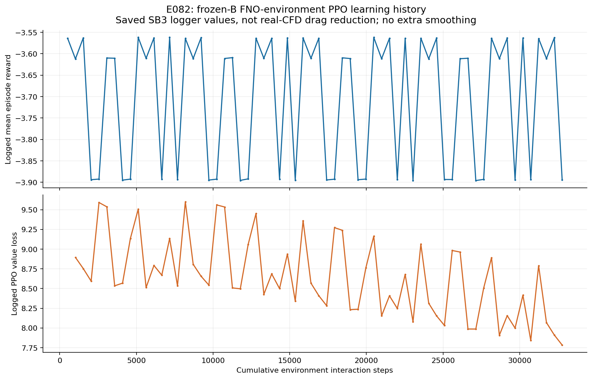
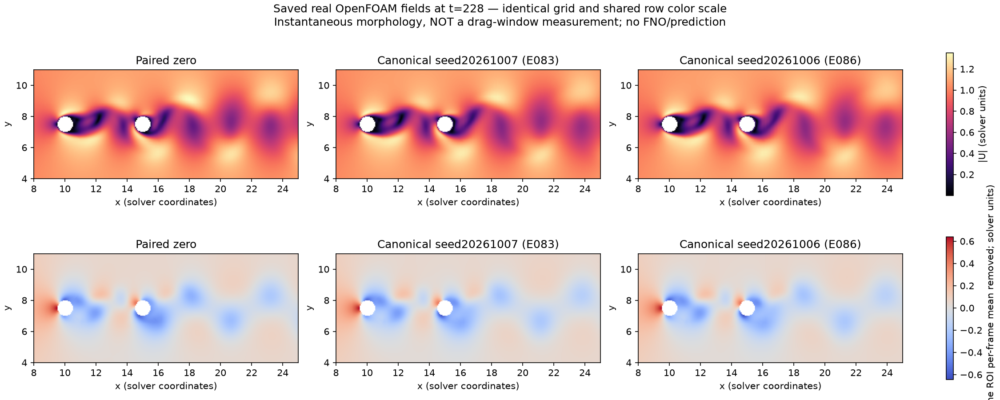
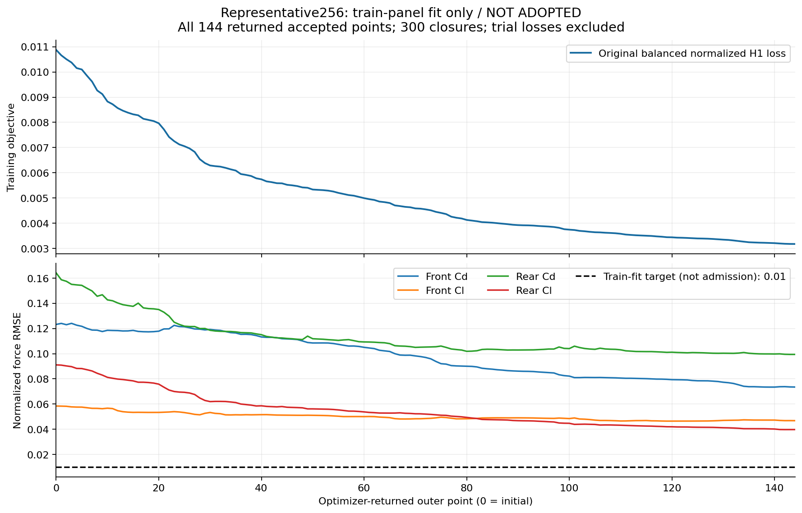
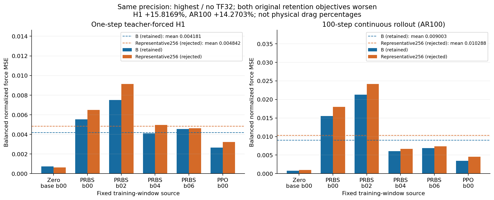
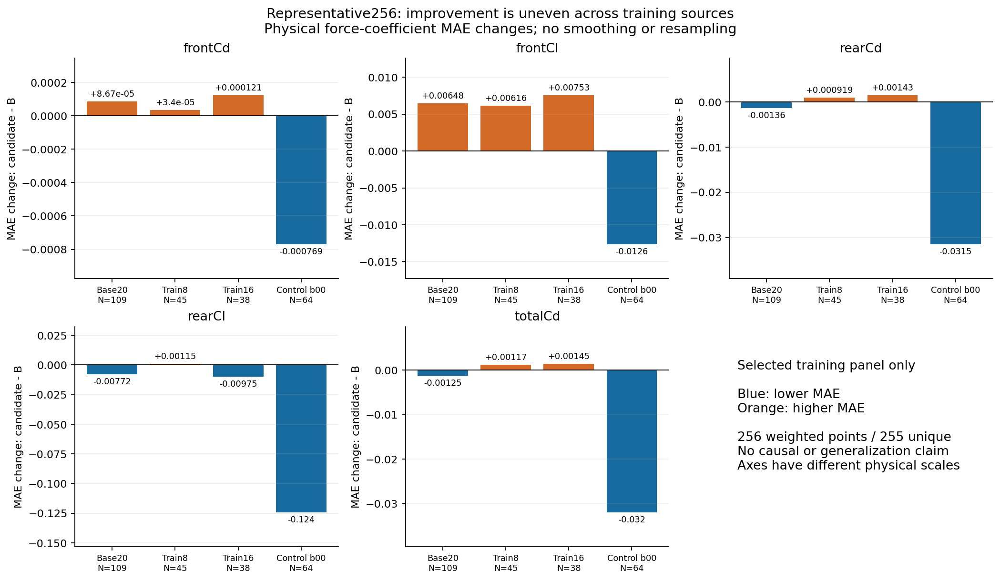
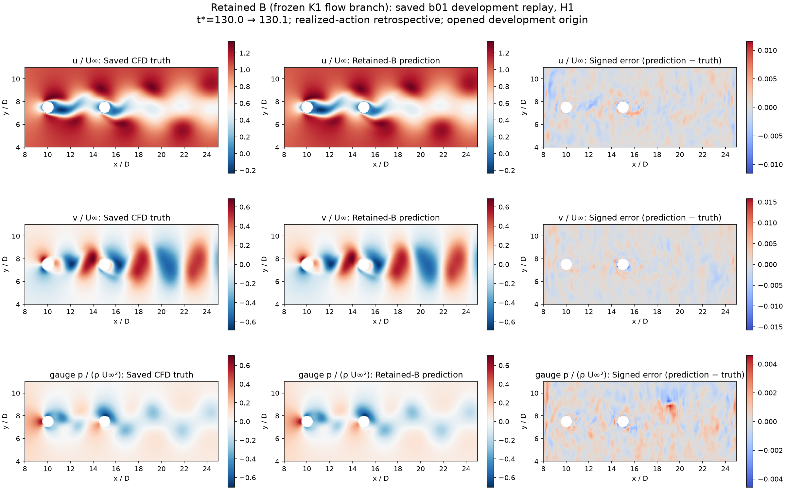
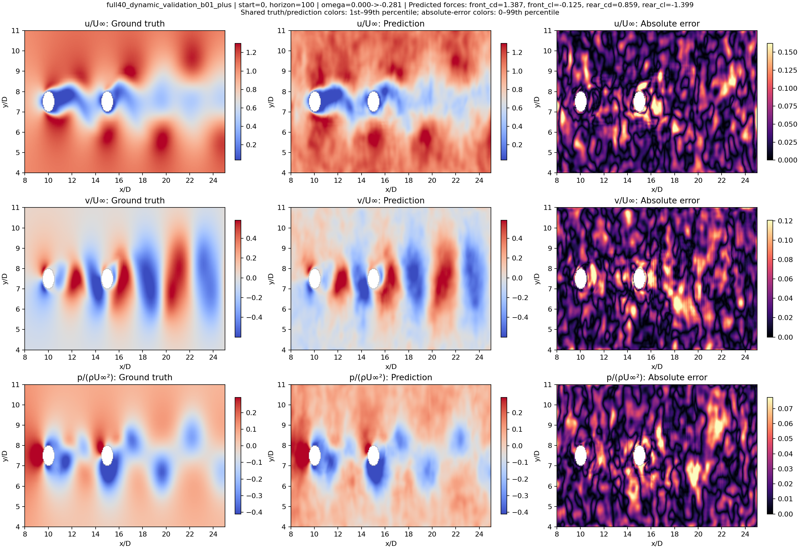

# 串列双圆柱主动流动控制项目最终图文报告

> **先看完整方案，再看实验结果：** 新增[总体技术方案与实施框架](TECHNICAL_BLUEPRINT_20261007.md)及[一页集成阅读的技术方案HTML](report_20261007/technical_design.html)。顺序为：总体蓝图→工作包与交接规则→分阶段实施/验收→数据工具栈→代理训练→MPC/PPO闭环。该方案在既有成果上补足顶层组织，不改变下面的实测结论，不代表启动了新训练或CFD。

> 状态基准：`2026-10-07T10:47Z`，用户恢复继续整理图文报告，但原科学测试硬截止`2026-10-07T12:20:45Z`和归档硬截止`2026-10-07T12:50:45Z`不变。Representative256训练与fixed-six均已独立终态并被拒绝；所有“通过/失败”均以已存在的独立报告、receipt和SHA为依据。本次更新只整理已有结果和图片，不改变模型、门限或默认B策略。

## 1. 一页结论

本项目已经完成一个**限定工况下、真实OpenFOAM反馈的主动流动控制闭环**：真实/curated CFD数据用于PhysicsNeMo FNO代理训练，HydroGym接口与Stable-Baselines3 PPO在冻结代理环境中学习策略；部署时不调用FNO，而由CPU PPO策略读取真实OpenFOAM观测、输出后圆柱旋转动作，再由OpenFOAM推进并返回下一观测。默认保留策略B在E114同分支连续延长的新增80 D/U中达到：减阻`4.13258915%`、rear-Cl去均值波动RMS比`.820771289`、均值偏置`1.235202589%`，并通过原`2% / 1.05 / 10%`门限、四个连续20 D/U块和两个joined窗口。

这里“闭环”特指**在线反馈控制**：每个反馈周期都使用真实CFD的69维观测，经冻结CPU PPO策略产生动作并推进下一段CFD。E114结果中的`scientific_admission=false`表示完整surrogate科学准入未通过，不表示上述三项物理门失败。每反馈约`1.3735 s`是该计算平台的墙钟耗时，不是已证明的物理实时控制性能；执行器净能耗也未核算。

同时，**高精度FNO预测与泛化目标没有完成**。B正式H100/动态预测和原force-window门仍FAIL；后续Absolute64、AR5、反射、pressure-aux、时序增量、late-state覆盖等候选出现局部改善，但没有同时通过预注册的保留性与固定开发集选择条件。不能把真实闭环的物理通过写成FNO完整预测通过，也不能反过来用预测FAIL否定已经实际完成的PPO→真实CFD闭环。

因此最终交付分为两层：

1. **可交付的基本案例：** Re100、L/D=5串列双圆柱，冻结B策略，CPU PPO＋真实OpenFOAM反馈；复现入口、800点真实反馈曲线、真实U/p场、动作/Cd/Cl及独立报告齐备。
2. **尚未完成的研究目标：** 代理对旋转动作下气动力的完整H1–H100预测质量、独立工况泛化、能稳定改善动作选择的FNO-MPC，以及统计意义上的多工况/多seed控制优势。

### 1.1 先读懂这些名词

| 名词 | 本项目里的准确含义 |
|---|---|
| FNO | Fourier Neural Operator（傅里叶神经算子），在规则网格上学习“当前流场＋动作→后续流场/受力”的代理模型；它不是CFD求解器。 |
| Curator / DataPipe | Curator负责把OpenFOAM/VTK结果整理为受约束的HDF训练数据；DataPipe按固定窗口、mask、normalization和动作历史把数据送入模型。二者都不产生新的物理真值。 |
| HydroGym / PPO | HydroGym提供环境接口；PPO（近端策略优化）用代理环境中的观测、动作和reward学习控制策略。真实部署时PPO读真实CFD观测，但不继续训练。 |
| MPC | Model Predictive Control（模型预测控制），用模型比较候选未来动作再选动作。本项目只完成有限工程探索，没有形成优于B-PPO的有效FNO-MPC。 |
| Cd / Cl | 阻力系数/升力系数。`Cd_front+Cd_rear`是总阻力；报告重点观察后柱`Cl`的波动和均值偏置。 |
| RMS / bias | RMS本义是均方根；本报告的“升力波动RMS”特指去均值后的`sqrt(mean((Cl−mean Cl)²))`，不同于包含均值偏置的`sqrt(mean(Cl²))`。bias是后柱平均升力相对zero去均值波动尺度的绝对比值。二者分别表示“抖动有多大”和“平均是否偏向一侧”。 |
| H1 / H5 / H100 | H1（teacher forcing）每个预测起点都使用真实状态，只向前一步；H5/H100多步AR把前一步预测继续作为后续输入，误差可能累积。H100滚动100个`.1 D/U`反馈间隔，共10 D/U，并非100个epoch。fixed-six使用事先给定的动作序列，不是测试时由PPO实时选动作，所以它是预测评估而非在线闭环。 |
| iteration / update / step | `solver step`是OpenFOAM的`.005 D/U`时间推进；`feedback step`是每`.1 D/U`一次控制；optimizer `update`是一次参数更新；LBFGS `closure`可在一次外层iteration中多次计算loss/梯度。它们不能互换。 |
| train / dev / test | train用于拟合参数；dev用于选择方案，反复查看后不再是独立测试；test应在选择冻结后一次使用。本项目多个开发相位已打开，因此不宣称独立泛化。 |
| closed loop / real time | closed loop表示每步由真实观测决定下一动作；real time要求计算延迟满足物理设备时限。本项目验证了前者，没有证明后者。 |

时间采用`D/U_inf`无量纲化：`t*=t U_inf/D`。因此`.1 D/U`就是无量纲时间增加0.1；在本case中一个反馈周期含20个`.005 D/U` CFD solver steps。

### 1.2 全流程怎么读

`OpenFOAM真实数据 → Curator/HDF → PhysicsNeMo FNO代理 → HydroGym/SB3 PPO训练 → 冻结CPU策略 → 真实OpenFOAM反馈验证`

这是一条**方法流程示意**，不是新的仿真结果。前半段用真实CFD训练代理和策略；最终E114部署只运行“冻结PPO策略＋真实OpenFOAM”，没有在线FNO推理。看图时必须分别问：图是CFD真值、代理预测，还是两者的误差；训练曲线下降也不能代替开发集或真实闭环证据。

## 2. 研究目标与判据

项目目标是针对串列双圆柱尾流，用动作条件FNO代理支撑策略学习，并在真实CFD中闭环降低总阻力和后柱升力波动。固定物理案例为：

- Reynolds数`Re=100`；圆柱直径约1；两圆柱中心约为`(10,7.5)`和`(15,7.5)`，中心距`L/D=5`；
- 控制量为后圆柱角速度，前圆柱不旋转；动作幅值和变化率受固定安全过滤器限制；
- CFD时间步`.005 D/U`，控制反馈间隔`.1 D/U`；典型800周期对应80 D/U；
- 物理主门限始终为：减阻`≥2%`、rear-Cl波动RMS比`≤1.05`、rear-Cl均值偏置`≤10%`；没有为收尾降低标准；
- 预测验收与控制验收分开：预测门包括H1/H5/H100、固定六窗连续AR100、开发面板及force-window统计；物理门基于配对zero分支的真实OpenFOAM受力。

实际case取`D=U_inf=rho=1`、运动黏度`nu=.01`，因此`Re=100`；无量纲时间`t*=t U_inf/D`。动作`omega*=Omega D/U_inf`在该配置数值等于OpenFOAM角速度，但圆柱表面速度比为`alpha=Omega D/(2U_inf)=omega/2`，所以`|omega|<=.75`对应`|alpha|<=.375`，不能把`.75`称为表面速度比。每个`.1 D/U`反馈周期的单filter限制`|delta_omega|<=.1`（等价`|d omega/dt*|<=1`），OpenFOAM区间内使用线性omega table。

实际求解网格的`checkMesh`记录为19,290 cells、39,336 points、77,539 faces，域`(0,0,0)`到`(30,15,.1)`；准二维单层front/back为`empty`。这与模型ROI的`128×256`采样网格不同。求解器为`pimpleFoam`，`dt=.005`；时间离散`backward`，对流项采用`Gauss linearUpwind grad(U)`，PIMPLE为1个outer corrector、2个corrector、1个non-orthogonal corrector。速度入口`(1,0,0)`、出口`zeroGradient`、上下边界`slip`、前柱`noSlip`、后柱绕`z`轴/中心`(15,7.5,0)`使用`rotatingWallVelocity`；压力出口为0，其余主要边界为`zeroGradient`。力系数配置`rhoInf=1`、`Uinf=1`、`lRef=1`、`Aref=.1`。

论文或演示必须注明：E109/E114是同一已打开分支的连续延长，不是统计独立的新工况；b01/b03已经作为开发相位打开，不是未见测试集。

物理指标的精确定义如下。令总阻力系数`CD=Cd_front+Cd_rear`；同一评价窗内受控/配对zero的均值分别为`mu_D,c`、`mu_D,0`。令受控后柱升力均值为`mu_L,c`，受控/zero去均值标准差为`sigma_L,c`、`sigma_L,0`。则减阻`D=1-mu_D,c/mu_D,0`，波动比`R=sigma_L,c/sigma_L,0`，偏置`Q=abs(mu_L,c)/sigma_L,0`。偏置不是`abs(mu_L,c-mu_L,0)`，也不除以mean Cl。验收为`D>=.02`、`R<=1.05`、`Q<=.10`；报告中的减阻/偏置百分数为`100D/100Q`，波动降低为`100(1-R)`。训练reward的baseline与最终配对物理窗口分别由各自approval绑定，不能混成同一个估计量。

## 3. 真实数据、OpenFOAM与Curator数据链

### 3.1 CFD与保存数据

真实求解器为OpenFOAM（历史批准绑定OpenFOAM 2512镜像）。原始case保留`U`、`p`、`phi`及backward格式旧时层，旋转壁面、`constant/polyMesh`和`system`配置；力函数对象保存前/后圆柱Cd/Cl，并在`functionObjectProperties`中保留pressure/viscous分量。配对控制验证分别推进受控分支和相同初态zero分支，控制器每`.1 D/U`读取真实观测并施加一次动作。

主要curated HDF轨迹包含801帧/800相邻对。模型ROI为`x=[8,25]`、`y=[4,11]`的`256×128`网格；网格间距约`dx=.0666667`、`dy=.0551181`。二值mask约428个固体单元，每个圆柱214个；HDF保存`state`、`mask`、`omega`、`force`、`time`。HDF只包含粗网格体数据和集成力标签，没有壁面法向、面积或wall-shear逐面分布，因此不能从这些HDF精确重建表面牵引。

B04晚期激励补充了一条120→200 D/U、801帧、16000 solver step的train-only轨迹；raw、VTK、Curator/HDF均经过独立核验。45条train-only轨迹共20,493帧的真实pressure/viscous/raw-total力分量另存sidecar，原HDF总力、normalization、split和mix未被改写。

### 3.2 官方组件与项目代码边界

| 环节 | 实际使用的官方/开源组件 | 项目自有实现 |
|---|---|---|
| 模型 | NVIDIA PhysicsNeMo `FNO`、官方checkpoint save/load | 双FNO拼接、历史输入、力通道空间均值、训练目标、冻结范围、manifest与fail-closed校验 |
| 数据 | PhysicsNeMo Curator框架、`VTKSource`、官方`HDF5Reader` | OpenFOAM case发现、frame/force/action时钟对齐、ROI采样、项目Filter/Sink、train-only视图与normalization绑定 |
| 环境/策略 | vendored HydroGym接口、Gymnasium、Stable-Baselines3 PPO | 69维观测适配、对称canonical坐标、reward/history/reset、动作幅值/变化率过滤、双solver管理 |
| 部署 | OpenFOAM真实求解器、Docker/systemd | CPU策略→动作→OpenFOAM→观测反馈循环、配对zero分支、资源守卫、审计receipt、看板 |

不能把项目的Curator子类、tandem DataPipe、奖励或安全过滤器称作PhysicsNeMo自带串列圆柱端到端样例。

## 4. 模型架构、输入输出与版本

### 4.1 FNO架构

默认B manifest固定的每个FNO架构为：`in_channels=6`、`out_channels=7`、`latent_channels=48`、5个FNO层、二维modes`[32,32]`、decoder 2层/宽128、padding 8、启用官方坐标特征。

项目的6个显式输入通道是：归一化`u`、`v`、gauge pressure `p`、fluid mask、当前角速度、下一角速度命令；PhysicsNeMo FNO内部再加入坐标特征。7个输出通道中，前3个是归一化状态增量`delta(u,v,p)`，通过`q_next=(q+delta)×mask`形成下一状态；后4个是归一化集成力（front Cd/Cl、rear Cd/Cl）的空间读出通道。项目代码对后4个空间输出做mask加权空间均值；这不是壁面积分或pressure/shear场预测。

采用双网络：flow FNO产生连续流场状态，aerodynamic FNO读出状态/动作并预测力。B训练只更新aerodynamic FNO的28个参数张量，flow FNO和气动力FNO输入升维网络的两个bias（`spec_encoder.lift_network.0.conv.bias`、`.2.conv.bias`）冻结。B使用K1历史长度1，100步rollout；原训练目标是归一化四力的`.5 H1 + .5 AR100`平衡损失，其中rear-Cl权重较高。

### 4.2 B训练合同

- 父模型：FC-P026-K1；
- 训练256窗：192个原始窗＋64个controlled-b00窗；
- 8窗累积、32次AdamW更新、seed`20261003`；
- learning rate`1.5625e-7`、betas`.9/.999`、eps`1e-8`、weight decay`1e-4`、gradient clip 1；
- chunk size 10、rollout 100；
- B历史precision为float32 matmul `high`、CUDA/cuDNN TF32开启；后续个别实验明确使用`highest/no-TF32`，不能混作同一precision结果。

### 4.3 实际绑定的软件版本

E082/B链实际记录的核心版本为：PhysicsNeMo`2.2.2`、PyTorch`2.14.1`、NumPy`2.5.3`、Stable-Baselines3`2.7.1`、Gymnasium`1.2.3`、h5py`3.16.0`；Curator历史版本`0.1.0`；HydroGym vendored upstream commit`4ab9854dea3d84e38a59c25e0f5835a00cf8225f`。`pyproject.toml`只有下界，不等于完整运行锁；每次执行以approval/source/runtime/import SHA为准。

## 5. 策略训练与部署谱系

需要区分三类东西：

1. **早期纯CFD/direct-PPO数据与基线。** train16等数据中存在直接CFD PPO产生的轨迹，它们是训练数据或历史策略证据，不等于最终默认B策略。
2. **默认B策略E082。** E082明确绑定冻结B FNO manifest `92766915cb11ca75d313608a5f75e61a218371dcc789f5b44725f0a8260e7891`，在代理环境中从fresh PPO训练32,768 transitions、512 optimizer hooks、256 PPO epochs；69维观测、H5 causal history、24个reset states、4环境。最终policy/VecNormalize由该执行保存，FNO tensor digest在PPO训练前后不变。
3. **真实CFD部署。** E085/E095/E109/E114加载E082冻结policy和VecNormalize，在CPU上对真实OpenFOAM观测做一次策略预测、物理方向恢复和安全过滤。部署阶段没有FNO forward，也不是在线MPC。因而“FNO代理训练PPO→真实CFD部署”是实际链路；不能写成PPO直接在本次真实CFD长跑中继续学习。

E082的`canonical_joint_v1` reward不是简单的`-Cd-Cl²`。对上节定义的`D/R/Q`，即时成本包含`cD=-clip(D,-1,1)`、阻力门违约`[max(0,(.02-D)/.02)]²`、波动门违约`[max(0,(R-1.05)/.05)]²`、偏置门违约`[max(0,(Q-.10)/.10)]²`，以及动作成本`.01(omega/.75)²`和变化率成本`.01(delta_omega/.1)²`；即时reward为`-.1`乘六项之和。62个因果力样本按`.1 D/U`覆盖6.2 D/U（首末时间戳跨度6.1），目标窗为6.15；历史不足时四项物理成本记0而动作两项仍计算，不读取未来力。PPO的`gamma=.99`只用于回报折扣，不改变即时成本公式。

[](report_20261007/assets/e082_ppo_learning.png)

**怎么看：** 横轴是累计代理环境交互步数，覆盖512→32768；上图是Stable-Baselines3 logger保存的滚动episode平均reward，下图是PPO value loss。图严格按65条保存日志连接，不额外平滑；episode reward的周期性与reset/episode组成有关，value loss下降是价值函数训练诊断。它们都不是Cd、Cl或真实CFD减阻曲线，不能用来挑选最终物理窗口或证明闭环收益；真正的物理结果见下一节E114。

## 6. 已完成真实闭环结果

以下是独立核验的主窗结果；RMS降低=`1−RMS比`：

| 执行 | 范围 | 减阻 | rear-Cl RMS降低 | 偏置 | 结论 |
|---|---|---:|---:|---:|---|
| E095 默认B b01复现 | 800反馈，130→210 | 4.0091% | 18.2810% | 3.6366% | 原六窗PASS；逐值复现E085 |
| E109 B后续时段 | 800反馈，248→328 | 3.9949% | 18.3412% | 2.8533% | 原六窗PASS；不是独立新工况 |
| E114 B连续延长 | 新增800反馈，328→408 | 4.132589% | 17.922871% | 1.235203% | 新80 D/U、四个20 D/U块、joined160/140均PASS |
| E111 Absolute64 b01探索 | 800反馈，130→210 | 4.1362% | 18.9804% | 1.6817% | 六窗PASS；部分早窗/全窗偏置与动作平方代价较B差，不替换B |

E114是当前最强的持续运行证据：同一case经精确restart回放后累计验证至160 D/U，但它不是独立Re、独立几何或统计泛化。动作平方只是一种动作代理，不是已核机械功率或净节能。

E114 result明确记录`fno_inference=false`、800 cycles、`start=328`、`end=408`。joined 160 D/U来自恢复连续的同一验证轨迹，不是第二个独立样本；约`1.3735 s/feedback`仅是墙钟吞吐，不能外推为实验装置的实时延迟。

[](report_20261007/assets/e114_closed_loop.png)

**怎么看：** 横轴是无量纲时间`t*=tU/D`，范围328.1→408；上/中排分别是每个`.1 D/U`端点保存的总Cd与后柱Cl，灰色为配对zero，蓝色为冻结B-PPO控制分支；下排是实际施加的无量纲角速度`omega*=Omega D/U`，虚线为`±.75`幅值界。每条线含800个反馈端点，不平滑、不降采样；连线只帮助阅读，并非`.005 D/U` solver-rate原始受力。图显示控制分支总阻力整体下移、Cl振幅收窄；正式门限仍由完整预注册时间窗统计而非肉眼判定。它不能证明跨工况泛化、净节能或物理实时性。

### 6.1 真实CFD场图（canonical E083/E086，非E114末帧）

[](report_20261007/assets/canonical_real_cfd_t228.png)

**怎么看：** 上排是速度模长、下排是每帧ROI去均值压力；三列使用相同行色标，依次为配对zero、canonical seed20261007（E083）和seed20261006（E086）。横纵轴是solver坐标，圆柱内部留白。来源是已保存的`t=228`真实OpenFOAM场，模型/策略分别绑定E083/E086 canonical执行，`model_inference=false`、`new_cfd_steps=0`。这张图只能比较单个时刻的尾流形态，不能从颜色直接读出80 D/U平均减阻，也不能冒充E114的`t=408`末帧。

## 7. 预测实验沿革：成功、失败与学到什么

### 7.1 默认B完整预测评估

B工程训练和官方reload通过，但完整预测准入FAIL。H100 validation10 rear-Cl/total-Cd MAE为`.0431183/.0112626`，dynamic6为`.0863972/.0285391`，没有整体优于K1。原force-window六分支仅b01-zero、b05-zero联合PASS；四个旋转分支的Cl fluctuation fidelity均失败。该FAIL保留。

### 7.2 后续主要候选

| 候选/方法 | 已测结果 | 决策 |
|---|---|---|
| Absolute64 | update32与B tensor digest一致；延长64更新后固定开发H1/H5局部改善，但fixed-six H1/AR均退化 | 不替换B；另行探索PPO/CFD只作有限证据 |
| AR5 reset G | H1力误差改善，连续AR100退化 | 原保留规则FAIL；B默认 |
| 真状态替代 | 多处不优于原预测状态 | 不能把问题简单归因于flow AR累积 |
| y-reflection配对 | 工程PASS；fixed-six H1`+4.1991%`、AR`+1.4529%` | retention FAIL；不跑dev/PPO/CFD |
| pressure-aux H | fixed-six H1改善`1.6023%`，AR退化`.4026%` | AND FAIL；不扫lambda |
| temporal-increment aux | H1改善`.01372%`，AR退化`.01913%` | 差异极小但AND严格FAIL；不包装为改善 |
| B04 late-state coverage I | fixed-six H1改善`4.14%`、AR改善`2.05%`；开发H1 rear-Cl/total-Cd却比B差`4.71%/4.05%` | 训练保留性PASS、固定开发FAIL；不推进PPO/CFD |
| B-H5 MPC 10周期 | 与旧K1动作完全相同；配对减阻`-.007886%`；B四项selected-next-step力MAE更大 | 只证明接线，未改善控制，不延长 |

固定40点LBFGS训练内诊断把loss从`.0404872`降到`.00142033`，rear-Cl MAE降到`.0249836`、total-Cd MAE降到`.00773824`，但四通道normalized RMSE仍高于`.01`且只是同40点拟合。这说明优化并未“完全停滞”，也不能证明泛化或模型容量充分。

### 7.3 Representative256训练终态

限时收尾前最后一个已批准训练，是固定256个真实H1点（192 original＋64 controlled-b00）的有界LBFGS拟合，父模型仍为B，模型结构不变，precision为`highest/no-TF32`，最多200个接受点/300 closures。unit `fluid-control-p064-representative256-training-20261007.service`、invocation `6bc6aca4e1bd48d5938b273d319fc716`正常结束；approval SHA为`42e8c15d4835ea6696ecb12271246d9babba16b73f869b4802b57bbc8dabc38c`。

独立R2审计PASS，但结论仅是工程/保存数组/checkpoint检查通过，不是科学准入。训练完成144个接受点、300次closure，按固定预算停止并恢复最后接受点；300个gradient panel加145个no-grad panel、每个26个microbatch，共11,570次aero forward，flow forward为0。加权训练loss从`.01087838225`降到`.00317233591`（约70.84%），末10个接受点仍下降；最终四通道normalized RMSE为`.07350795/.04681488/.09940523/.03975477`，全部高于不变的`.01`训练拟合目标。rear-Cl MAE从`.07402691`降到`.03843786`，total-Cd MAE从`.02099059`降到`.01288914`，但front-Cl MAE从`.00944933`升到`.01125044`，不能写成所有误差均改善，也不能据此证明容量不足、收敛或泛化。

[](report_20261007/assets/rep256_accepted_fit.png)

**怎么看：** 横轴0是父模型初值，之后每一点都是优化器实际返回并保存的accepted point；300次closure中的线搜索trial没有混入，也没有事后挑“最佳trial”。上图为训练目标，下图为四个归一化受力通道RMSE，虚线`.01`只是事前训练内拟合目标，不是控制准入。曲线持续下降但全部通道仍高于`.01`，且只针对固定256个训练点；因此只能说明“预算内继续拟合”，不能说明泛化或闭环改善。

result SHA为`50617c1c49cebcdc2198fb1cc427f7a7289dc1912846d3f882b0a257025b6d6a`，candidate manifest SHA为`793bbdab1da9fb26ebfa27a2efe607b1ccb24c10a4bd73dcc726d4253b696848`，独立receipt SHA为`d3286db5da8c4919718e0d70e651df2c9a92eaffb083ee34275bf6b16ce1992f`，报告见[P064_REPRESENTATIVE256_TERMINAL_REVIEW_20261007.md](P064_REPRESENTATIVE256_TERMINAL_REVIEW_20261007.md)，SHA `b6d794a6f4d817fdac8a10899700b348584c78b142944110b1d57fe02b4d944d`。官方fresh reload由producer完成；独立审计无模型构建/forward，并核验256个真实target、原normalization、LBFGS state、父/候选tensor digest、冻结bias与flow文件。R1只因NumPy 2.5拒绝`float(shape(1,))`而审计失败，R2仅修scalar读取，没有重训。

随后完成同`highest/no-TF32`条件下的原fixed-six训练保留性检查；必须与本次同precision重算的B比较，不能借用历史`high/TF32`缓存。结果如下：

| 指标 | 同precision B | Representative256 | 相对变化 | 判定 |
|---|---:|---:|---:|---|
| fixed-six H1 balanced | `.004181029586` | `.004842338987` | `+15.816903%` | 退化 |
| fixed-six AR100 balanced | `.009002923189` | `.010287666596` | `+14.270292%` | 退化 |

[](report_20261007/assets/rep256_fixed_six.png)

**怎么看：** 每组柱是固定六个原训练窗口之一，左图是teacher-forced H1，右图是连续AR100；蓝色B和橙色Representative256在相同`highest/no-TF32`精度下比较，虚线是六窗算术均值。数值是归一化balanced force MSE，不是减阻百分数。候选均值分别恶化15.8169%和14.2703%，所以即使上图训练loss下降，原保留性AND仍FAIL。

工程执行和12行/2,400个四力向量（9,600 scalar）的独立数组复算均PASS，但原“双项均不退化”AND明确FAIL。工程result SHA为`57add3a45f4cedcde94fbc242337e64cd6d54d51156e4d2be27c29cb8c309289`；[独立评审](P064_REPRESENTATIVE256_FIXED_SIX_INDEPENDENT_REVIEW_20261007.md) SHA为`9c7403f0df5b0f6de7d680d5690d03af856b2e3b414367de850fc1ae80fd731b`。这正体现训练面板loss下降不等于连续预测改善。该候选不替换B，不执行dev、PPO或CFD。

### 7.4 为什么“继续把训练loss压低”未必有效

已保存数组的failure-map把Representative256前后误差按数据来源和力通道拆开。训练集平均改善高度集中在64个controlled-b00点：rear-Cl MAE从`.180123`降到`.055894`、total-Cd MAE从`.045752`降到`.013783`，分别贡献整体对应MAE下降的87.3%和98.7%。但选入面板的45个train8点上，四个力通道MAE全部变差；在真正用于保留性判断的fixed-six H1中，front-Cl六个case又全部变差。

这说明平均loss下降掩盖了来源与通道之间的权衡：既有选点之外的退化，也有选中点自身的退化。因此剩余时间内盲目增加closure/训练步数，没有直接证据能修复连续AR或跨来源泛化。现有证据仍不能区分究竟是采样稀疏、共享参数梯度干扰还是参数漂移；这些是后续可证伪假设，不是本项目已经确定的根因。

[](report_20261007/assets/rep256_failure_map.png)

**怎么看：** 图画的是Representative256候选相对B父模型的`MAE差值（candidate−B）`，按数据family分面，包含front/rear Cd/Cl四个通道及total-Cd；零线下方的负值表示改善，零线上方的正值表示退化。它用于发现平均loss背后的不均匀变化，不是新的准入门，也没有通过挑选family改变原fixed-six结论。样本数和来源不同，不能从柱高直接推导统计显著性或唯一因果机制。

### 7.5 当前B冻结流场分支的H1/H5保存回放

[](report_20261007/assets/retained_b_fields_h1.png)

**H1怎么看：** 三行是反归一化后的无量纲`u/U_inf`、`v/U_inf`和去均值`p/(rho U_inf²)`；左/中列是真实CFD和当前B双FNO所用冻结K1流场分支的预测，共用色标；右列是`prediction−truth`有符号误差，用独立对称色标。来源是绑定B manifest的已保存b01起点0开发回放，`t*=130→130.1`；本次只画已有NPZ，没有加载模型或新增推理。H1使用真实起点，因此误差较小并不证明长滚动稳定。

[](report_20261007/assets/retained_b_fields_h5.png)

**H5怎么看：** 布局与H1相同，时间为`t*=130→130.5`。这是realized-action retrospective replay：动作来自已经发生的轨迹，而非模型面对未知动作的前瞻选择；b01起点也已是打开的development数据，不是独立测试。误差色标相较H1扩大，说明多步误差会累积，但单个起点不能代表完整force-window或H100总体质量。

### 7.6 历史代理流场误差图（仅诊断，不是当前B或Representative256）

[](report_20261007/assets/historical_fcp003c_h100.png)

**怎么看：** 三行依次为`u/U_inf`、`v/U_inf`和`p/(rho U_inf^2)`，三列依次为ground truth、prediction、absolute error；真值与预测共享色标，误差列使用独立的非负色标。该图来自历史`FCP003c final`模型、`full40_dynamic_validation_b01_plus`、start 0、H100（滚动10 D/U），动作由`omega=0→-0.281`。图中真值和预测都可见涡街结构，同时存在广泛局部误差；相位、频率是否一致仍需专门时序指标，不能凭图断言。**它不是当前B、I或Representative256模型的图，也不是当前候选精度证据**；不能用它宣称当前B场预测通过或解释E114控制收益。

## 8. 训练误差、泛化误差和控制收益的关系

三类证据必须分开：

- **训练内误差**可以说明优化器是否在固定点上下降，不能说明新相位/新轨迹泛化。
- **固定预测评估**能比较H1/H5/AR100和force-window，但有限origin的小差异不是统计显著性，也不能单独证明动作排序正确。
- **真实CFD闭环**直接证明固定case中的策略物理表现，但策略可以在不完美代理上学到可用行为；它不反向证明代理精确。

项目观察正体现这种分离：B预测FAIL但真实B-PPO闭环通过；I在训练fixed-six改善却在固定dev变差；若只按预测drag排序，短动作诊断会增加Cl²；B-H5 MPC的GPU排序复放正确也没有转化成10周期动作变化或物理收益。

## 9. 复现与查看

### 9.1 默认安全入口（只预检，不启动）

```bash
cd /workspace/fluid_control
python3 scripts/reproduce_canonical_closed_loop.py
```

预期返回`PREFLIGHT_PASS_NOT_RUNNING`。它核验现有策略、VecNormalize、OpenFOAM restart、源/runtime/image和资源，不重训FNO/PPO，也不新建CFD输出。真正重跑必须新建approval、unit和output，并再次审批；历史批准不可复用。

### 9.2 看板

Spark本机：`http://127.0.0.1:8766/`；已有Mac端口转发时：`http://localhost:8766/`。API为`/api/state`。看板展示真实unit/invocation、训练接受点或CFD反馈曲线；浏览器打不开不等于科学进程停止，应以systemd和artifact为准。

本报告的完整离线图文版为[report_20261007/index.html](report_20261007/index.html)。HTML不依赖CDN或在线脚本，核心图片均在同目录`assets/`，可点击打开PNG原分辨率或直接下载；复制整个`report_20261007/`目录即可离线阅读正文和图片。若要打开正文链接的独立审计报告、runbook等外部证据，还需一并复制完整`docs/`树。

离线目录另附少量可直接检查的论文表格/审计证据：`evidence/rep256_failure_map_metrics.csv`、`evidence/rep256_fixed_six_result.json`、`evidence/paper_baseline_fairness_receipt.json`和`evidence/paper_baseline_fairness_pre_execution_plan.md`。它们不包含大HDF、CFD场、checkpoint或完整历史artifact；这些大文件仍只在Spark并由SHA清单引用，不能声称复制本目录即可离线重放全部项目。

现有真实流场图入口`#canonical-seeds-real-cfd-t228`对应E083/E086的两个指定canonical seed，不是E114末帧，也不是FNO预测。图路径为`artifacts/p064_canonical_seeds_real_cfd_t228_comparison_20261007/real_cfd_t228_comparison.png`（SHA `7926b3ba6919afc211faa941644df3df37ff75614604acba35869161653d4afe`），manifest SHA `fd63bbfbd5adb3a04606cd7335c76de9ecab04f4bc53025afa928abe223b10c1`，来源分别绑定canonical seed20261007、seed20261006及zero的`t=228`真实U/p保存场。E114的动作/Cd/Cl曲线由看板对应continuation结果展示；当前没有把E083/E086瞬时流场冒充E114场图。

### 9.3 多阶段复现

完整交接见[CANONICAL_MULTI_STAGE_RUNBOOK_20261007.md](CANONICAL_MULTI_STAGE_RUNBOOK_20261007.md)和`CANONICAL_CHAIN_INPUT_INVENTORY_20261007.json`。历史批准的`--verify-payload-bytes`审计（invocation `210169b4918a41d9bb47b02396851a06`）对851项元数据/源码和55个payload合计完成906次SHA校验；本轮收尾运行默认checker时结果为`READ_ONLY_INVENTORY_PASS_NOT_EXECUTION`，只对851项做SHA校验、另55项仅检查payload存在，不能写成本轮再次重hash全部payload。它未运行Docker/科学任务，也未独立复核当前已装package版本。起点仍是Spark现有runtime、curated数据和预训练K1，并非从原始CFD开始重新训练upstream flow/K1/B/PPO的全新实跑。

## 10. 模型与大文件归档原则

Git保存源代码、配置、审批、报告、测试和SHA清单；以下大文件保留在Spark主节点，不直接提交Git：HDF数据、OpenFOAM case/场、VTK、FNO checkpoint、PPO zip、VecNormalize、容器镜像。关键现有身份包括：

| 对象 | 主节点路径/身份 | SHA/说明 |
|---|---|---|
| 默认B dual manifest | `artifacts/fcp064_controlled_aero_arm_b_20261006/dual_model_manifest.json` | `92766915cb11ca75d313608a5f75e61a218371dcc789f5b44725f0a8260e7891` |
| B aero model archive | 同B manifest相对路径 | `57d4634df22ce96c1c4467a2ed52412be452375129af05b89f10a690e363356e` |
| frozen flow archive | 同B manifest相对路径 | `dc41fc91d42476e052970b39fc66aed22fa72aa8b6f218a341a3abb095f42e31` |
| E082 canonical PPO产物 | `artifacts/p064_b_symmetry_canonical_h5_32768_ppo_20261007/payload/` | policy `5c05699e0851787d85d40c407647f80c19d3aebeb7dff82e019336cde77c6c6e`；VecNormalize `1d25005144b6436c3e2641ee89d1585e3c9f8b9fdb1f26b9cd39c7d83610c145` |
| E114结果 | continuation output/result | `752b92d1063e51a8fb6a45ea539b173c3c5ffbd24c6a83255e0fa649f392063e` |
| Representative256 | `artifacts/p064_representative256_training_20261007/` | result `50617c1c…b6d6a`；manifest `793bbdab…6848`；训练目标未达且fixed-six双退化，候选拒绝 |

最终模型与复现manifest应列出绝对路径、大小、SHA256、生产approval、consumer协议、runtime和是否已独立reload；不能只写“latest”。Representative256的完整未采用工件清单见[REJECTED_REPRESENTATIVE256_MODEL_MANIFEST_20261007.md](REJECTED_REPRESENTATIVE256_MODEL_MANIFEST_20261007.md)，不得将其路径靠“最新”规则晋级为默认B。

## 11. 限制与不能宣称的内容

1. 工况主要是Re100、固定几何；没有证明跨Re、跨间距、跨网格或实验流场泛化。
2. 多个开发相位已经打开，不能继续称为未见测试；候选间比较样本量小，不给统计显著性结论。
3. 当前FNO没有通过完整气动力force-window预测门；粗ROI缺少精确壁面牵引信息。
4. 真实部署是CPU PPO＋OpenFOAM在线反馈，不是在线FNO/MPC；约`1.3735 s/feedback`的CFD wall time不是物理实时控制证明。
5. 减阻没有扣除旋转执行器机械功；omega²/action penalty不是净能耗。
6. E114是恢复后连续同case证据，不是单一进程不间断160 D/U，也不是独立随机复现实验。
7. Git不携带全部数据、模型、镜像和环境；离开Spark仅凭Git不能完整重建历史结果。
8. Representative256训练与fixed-six均已独立核验并拒绝；任何未执行的后续评估仍必须写“未执行/未知”，不能以日志或训练面板代替开发/控制证据。

### 11.1 尚未完成、若继续研究应怎样验证

1. **旋转动作下的受力预测：** 仍需在冻结且未参与选择的origin/相位上，同时验证H1、H5、连续AR100和原force-window的Cd/Cl幅值、相位、均值与波动；不能只看平均训练loss。
2. **远期可选的跨工况扩展：** 当前任务物理范围仍固定为Re100、L/D=5；若未来要主张跨Re、间距或网格泛化，才需要事前固定新工况并保留独立zero/controlled truth。它不是当前基本案例交付的必补项，现阶段指标未知。
3. **FNO-MPC动作价值：** 必须用相同真实起点、候选动作和完整因果62点历史，对代理动作排序做配对CFD反事实验证，再运行足够长的真实闭环。现有10周期探索动作未区别于K1且无物理收益。
4. **统计复现：** 需要多个独立策略seed和独立CFD起点；E114的joined窗口是同一连续轨迹，不可替代独立重复。
5. **工程部署：** 需要测量端到端传感、推理、执行器和求解/实验延迟，并核算旋转功率，才能回答物理实时性与净节能。
6. **配对公平性复核：** 若要把当前物理结果上升为更强控制结论，还应明确复核control/zero两分支使用相同网格、离散设置、起点和事前固定且覆盖足够脱落周期的比较窗；当前长轨迹门限PASS不自动替代该专门审计。
7. **网格与时间步独立性：** control/zero使用同网格只能保证配对公平，不能证明结果对网格或`dt`收敛。后者需要预先设计的多分辨率/多时间步计算，当前尚未完成，也不是本轮基本案例PASS的既有证据。

这些条目是未完成验证清单，不是新的准入放宽或已授权实验。截止前不再通过增加相同训练步数来替代上述证据。

### 11.2 已保存基线的公平性审计结论

本轮只读审计进一步确认：历史P10/P20周期控制使用峰值`omega=1`且起点/窗口不同，不能作为当前B（`|omega|≤.75`、`|delta omega|≤.1/反馈周期`）的公平开环对照；历史恒`omega=+1`粗/中网格对显示后Cd均值差`.15624%`、后Cl去均值RMS差`1.06153%`，但它验证的不是当前反馈策略，不能外推B约4%减阻的数值不确定度。E114既有审计已经覆盖800 cycles、799 feedback links、1600 solver logs、`.005`时钟和动作filter，不需要重复同一raw核验。

因此，论文若要增加“优于开环基线”或“网格/时间步收敛”的更强结论，应分别执行事前冻结、同初态/网格/时间步/窗口/动作约束的开环比较，以及B/zero成对的半时间步和独立中网格验证；目前均未执行、未授权，不能用历史结果补位。完整边界见[CLOSED_LOOP_PAPER_VALIDATION_GAPS_20261007.md](CLOSED_LOOP_PAPER_VALIDATION_GAPS_20261007.md)。

## 12. 与港理工唐辉相关研究的关系：方法借鉴，不是严格复现

最接近且已核书目信息的文献是Zhao、Zhou、Ren、Tang、Wang (2024)，*Mitigating the lift of a circular cylinder in wake flow using deep reinforcement learning guided self-rotation*，Ocean Engineering 306, 118138（[DOI](https://doi.org/10.1016/j.oceaneng.2024.118138)，[PolyU官方记录](https://research.polyu.edu.hk/en/publications/mitigating-the-lift-of-a-circular-cylinder-in-wake-flow-using-dee/)）。该工作以传感反馈PPO和自旋转抑制尾流升力波动，为本项目提供了方法动机；摘要中的`L*=5`、800 episodes和约98%升力波动降低是原论文结果，不能移植为本项目成绩。最近这篇同样使用旋转执行器，不能误称执行器不同；喷流论文或历史三柱fluidic pinball方案才属于不同执行器/几何。

本项目验证的是Re100、项目定义`L/D=5`的两个固定中心串列圆柱，以后柱旋转控制，评价总阻力、后柱升力波动及均值偏置，没有结构位移耦合，因此不是VIV验证。本项目使用自己的OpenFOAM、PhysicsNeMo FNO、HydroGym/SB3和控制适配；尚未逐项对齐该论文的传感器、动作约束、reward、无量纲定义及训练过程，也未取得作者代码/原始轨迹做重放。现有source audit明确完整正文未形成可复现获取证据，因此不能沿用旧笔记中未核的“32 sensors/q±6/仅后柱旋转”等细节。准确表述应是“受相关研究启发的独立工程案例”，不是该论文严格复现，也未达到或声称其98%指标。

HydroGym相关官方工作提供标准环境接口、solver-independent方法和代理策略向CFD迁移的背景，但不是本案例的直接性能对标；本报告不作“最新”或“SOTA”结论。引用可信度边界见[POLYU_ZHAO_2024_SOURCE_AUDIT_20261003.md](POLYU_ZHAO_2024_SOURCE_AUDIT_20261003.md)。

## 13. 论文可用结论与建议表述

### 可支持的结论

- 在限定Re100串列圆柱案例中，使用PhysicsNeMo FNO代理训练的PPO策略可以部署到真实OpenFOAM反馈循环，并在预注册窗口达到约`4.13%`减阻，同时保持rear-Cl波动和偏置门限。
- 同一冻结策略经精确restart后在额外80 D/U、四个连续20 D/U块及joined窗口保持门限，提供了比单一60 D/U主窗更长的同工况持续性证据。
- 代理预测准入与闭环控制收益并不等价：多个预测loss/覆盖改动只产生局部改善，固定开发或连续AR指标仍可退化；保留严格分层评估是必要的。
- 官方PhysicsNeMo/Curator/HDF5Reader、HydroGym/SB3与OpenFOAM可以通过项目级数据、身份和安全适配形成可审计链路。

### 不可支持的结论

- “FNO已经高精度预测旋转圆柱气动力”或“完整目标全部完成”；
- “Absolute64/I/其他候选全面优于B”或具有统计显著优势；
- “已证明实时控制、净节能、跨工况泛化或实验可迁移”；
- “全部链路只使用官方开箱即用组件”；
- “仅凭Git可以从零复现全部模型和CFD”。

## 14. 核心证据索引

- 当前简明交付：[CURRENT_DELIVERY_SUMMARY_ZH.md](CURRENT_DELIVERY_SUMMARY_ZH.md)
- E114持续闭环：[P064_B_CONTINUATION_328_408_TERMINAL_REVIEW_20261007.md](P064_B_CONTINUATION_328_408_TERMINAL_REVIEW_20261007.md)
- canonical b01复现：[CANONICAL_B01_REPRODUCTION_TERMINAL_REVIEW_20261007.md](CANONICAL_B01_REPRODUCTION_TERMINAL_REVIEW_20261007.md)
- E082 canonical B PPO工程：[P064_B_SYMMETRY_CANONICAL_PPO_TERMINAL_REVIEW_20261007.md](P064_B_SYMMETRY_CANONICAL_PPO_TERMINAL_REVIEW_20261007.md)
- B完整预测FAIL：[P064_B_FORMAL_TERMINAL_REVIEW_20261006.md](P064_B_FORMAL_TERMINAL_REVIEW_20261006.md)
- I固定开发FAIL：[P064_B04_COVERAGE_I_DEVELOPMENT_TERMINAL_REVIEW_20261007.md](P064_B04_COVERAGE_I_DEVELOPMENT_TERMINAL_REVIEW_20261007.md)
- 时序增量FAIL：[P064_TEMPORAL_INCREMENT_AUX_TERMINAL_REVIEW_20261007.md](P064_TEMPORAL_INCREMENT_AUX_TERMINAL_REVIEW_20261007.md)
- Representative256训练终态：[P064_REPRESENTATIVE256_TERMINAL_REVIEW_20261007.md](P064_REPRESENTATIVE256_TERMINAL_REVIEW_20261007.md)
- Representative256 fixed-six FAIL：[P064_REPRESENTATIVE256_FIXED_SIX_INDEPENDENT_REVIEW_20261007.md](P064_REPRESENTATIVE256_FIXED_SIX_INDEPENDENT_REVIEW_20261007.md)
- Representative256 failure-map：[P064_REPRESENTATIVE256_FAILURE_MAP_20261007.md](P064_REPRESENTATIVE256_FAILURE_MAP_20261007.md)
- 闭环论文验证缺项与公平基线：[CLOSED_LOOP_PAPER_VALIDATION_GAPS_20261007.md](CLOSED_LOOP_PAPER_VALIDATION_GAPS_20261007.md)
- 数据表示审计：[P064_FORCE_REPRESENTATION_DATA_AUDIT_20261007.md](P064_FORCE_REPRESENTATION_DATA_AUDIT_20261007.md)
- 安全入口：[CANONICAL_CLOSED_LOOP_QUICKSTART.md](CANONICAL_CLOSED_LOOP_QUICKSTART.md)
- 多阶段runbook：[CANONICAL_MULTI_STAGE_RUNBOOK_20261007.md](CANONICAL_MULTI_STAGE_RUNBOOK_20261007.md)
- 端到端边界：[END_TO_END_DELIVERY_AUDIT_20261007.md](END_TO_END_DELIVERY_AUDIT_20261007.md)
- 硬截止：[PROJECT_CLOSEOUT_DEADLINES_20261007.md](PROJECT_CLOSEOUT_DEADLINES_20261007.md)
- 模型与复现清单：[FINAL_MODEL_AND_REPRODUCTION_MANIFEST_20261007.md](FINAL_MODEL_AND_REPRODUCTION_MANIFEST_20261007.md)

## 15. 收尾待办与后续授权边界

- [x] 填写Representative256训练终态与fixed-six独审；训练loss下降但fixed-six双项退化，候选拒绝。
- [x] 生成最终模型/数据/策略/镜像SHA与路径清单，标注Git外大文件，见[FINAL_MODEL_AND_REPRODUCTION_MANIFEST_20261007.md](FINAL_MODEL_AND_REPRODUCTION_MANIFEST_20261007.md)。
- [x] 更新`PROJECT_STATE.md`、`docs/RESEARCH_ROADMAP.md`、`EXPERIMENTS.md`、`DECISIONS.md`和`experiments/results.csv`的最终状态；CSV最终检查为1,356行、22列且每行schema一致。
- [x] 完成有限只读/CPU验证：Representative256及复现相关非Torch回归37项PASS，fixed-six Torch fixture 3项PASS，Root独立四文件smoke 25项PASS；6份收尾核心文档及后续终态报告/清单共106个相对链接全部存在。安全复现入口实际返回`PREFLIGHT_PASS_NOT_RUNNING`；inventory本轮返回851 SHA＋55存在性检查，不启动CFD、训练或模型推理。
- [x] 完成scoped GitLab同步。收尾提交链为`91d3f47`（总报告/截止/清单首版）、`05d4d00`、`cc94986`、`c9594f0`、`60be91e`、`2c66bb7`（Representative256终态、fixed-six、UI、台账和拒绝模型清单）及`41f9819`（官方文献与清单链接修订）；这些均已推送到`origin/sanitized-main`。

此前限时阶段的科学任务已结束：本次图文更新时没有训练、推理评估、PPO、CFD或数据转换任务继续运行，dashboard和只读资源监控保留。旧`training-evaluation-watchdog.timer`自`2026-10-07T09:23:06Z`起保持`inactive/dead/disabled`，避免历史post-eval自动复启。交付的基本B-PPO/OpenFOAM在线反馈案例保持原物理门限PASS；完整高精度FNO预测、跨工况泛化和有效FNO-MPC目标仍未完成，未被收尾文档改写为PASS。

用户已允许继续完善有价值的验证与图文证据，但任何新科学评估仍须先明确缺口、固定协议并获得Lead审批；本报告本身不授权自动启动训练、推理、PPO或CFD。原硬截止和旧watchdog禁用状态保持。
