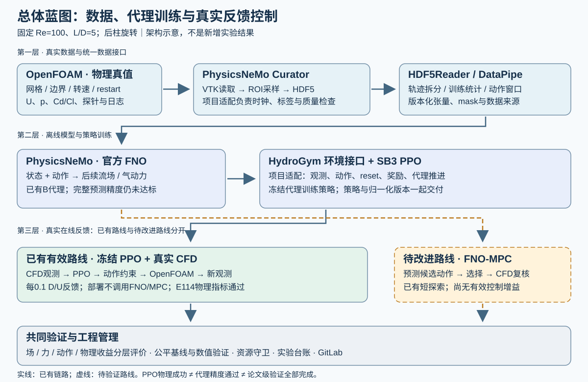

# 串列双圆柱代理辅助流动控制：总体技术方案与实施蓝图

> 版本：2026-10-07。本文是对现有项目的增补设计，不替换已有模型、实验或验收结果，不授权重启训练或CFD。当前范围固定为Re=100、L/D=5、前柱固定、后柱旋转；“待实现”均指后续建议，不代表代码已经具备能力。实测结果见[图文实验报告](PROJECT_FINAL_REPORT_20261007.md)。

## 1. 方案定位：交付什么，不改变什么

研究问题是：能否用真实CFD建立动作条件流场代理，再用该代理辅助控制策略设计，使两个圆柱的总平均阻力降低，同时限制后柱升力波动和平均侧向力，并在真实CFD反馈循环中验证？

这里的“真实CFD”指实际数值求解Navier–Stokes方程得到的结果，不指风洞实测。流场代理是CFD的近似模型，不能自行提供物理真值。论文素材必须分别说明：数值模型误差、机器学习预测误差和控制效果。

项目分成三个交付层次：

| 层次 | 目标及证明方式 | 当前状态 |
|---|---|---|
| 基本案例 | 数据→官方FNO→代理环境PPO→真实OpenFOAM反馈，并报告实际Cd/Cl与动作 | 已贯通；保留B/E082为默认，不重新推翻 |
| 可靠代理辅助控制 | 场与气动力预测满足原协议，动作响应可信；MPC或新PPO能够在真实CFD保持效果 | 完整预测验收未通过；MPC仅有无有效增益的有限探索 |
| 论文级结论 | 公平控制基线、最终策略离散误差、独立重复、计算与控制代价、消融及可复现证据 | 部分具备，仍需专门补实验，不能由基本案例通过替代 |

当前E114新增80 D/U的实测结果为总减阻4.1326%、后柱去均值升力RMS降低17.9229%、平均升力偏置为无控制波动尺度的1.2352%。它支持限定工况的持续反馈效果；不证明跨工况泛化、物理实时性、净节能或整个研究目标完成。

## 2. 总体蓝图与分层技术架构



图为设计示意，不是新增实验。实线表示已有数据或控制链路；虚线表示仍需验证的MPC及数据补充路线。已有PPO策略部署不在每个反馈周期调用FNO。

| 层 | 主要责任 | 输入→输出 | 不能替代的责任 |
|---|---|---|---|
| 物理仿真层 | OpenFOAM设置几何、网格、边界、旋转与时间推进 | case/restart/动作→U、p、前后柱Cd/Cl、探针、日志 | 不能以FNO预测代替受控效果的最终物理评价 |
| 数据层 | Curator整理、采样、写HDF；DataPipe形成训练窗口 | 原始场/力/动作时钟→可追溯HDF与张量 | Curator不是CFD；DataPipe不是新的求解器或数据生成器 |
| 代理层 | 官方PhysicsNeMo FNO预测状态和气动力 | 当前状态与动作→预测后续场/力 | 模型低loss不等于动作排序可靠；模型不自带本项目控制逻辑 |
| 控制设计层 | HydroGym接口组织环境；SB3 PPO学习策略；项目MPC比较候选动作 | 状态、观测、奖励/代价→策略或动作 | HydroGym接口不自动实现本项目OpenFOAM桥接或训练FNO |
| 真实反馈层 | 固定策略或获准控制器读取CFD观测，施加动作后继续求解 | CFD观测→动作约束→CFD下一时刻 | 代理训练中的奖励不能作为这层的物理收益 |
| 验证与工程层 | 版本、独立评估、资源、日志、恢复、图表 | 源码/数据/结果身份→可审计结论 | GPU繁忙、任务exit0、图像平滑均不是科学验收 |

详细应用与接口见[数据和技术栈方案](TECHNICAL_DESIGN_DATA_STACK_20261007.md)；训练见[代理训练方案](TECHNICAL_DESIGN_SURROGATE_TRAINING_20261007.md)；控制见[控制实施路线](TECHNICAL_DESIGN_CONTROL_ROADMAP_20261007.md)。HTML技术方案将三份内容直接附在同一页面，避免只提供链接而无法连贯阅读。

### 2.1 两条已有/规划路线必须分清

**路线A：已有代理训练PPO、真实CFD执行。** 离线阶段使用OpenFOAM数据训练FNO；在固定代理环境中用PPO学习观测到动作的映射。部署阶段冻结PPO与观测归一化，每次读取真实CFD观测，生成后柱旋转动作并推进CFD。E114的物理结果属于这条路线。

**路线B：待改进的FNO-MPC。** 每个真实反馈周期从当前已知状态和历史出发，用FNO比较多个候选动作序列，执行选中序列的第一步，得到新CFD观测后重新规划。其核心难点是代理能否正确预测不同动作之间的差别，而不只是流场整体看起来相近。现有短探索没有建立控制优势，不能仅把预测时长加大就宣布路线有效。

两条路线共享物理对象、动作约束、数据与评价协议，但不要求先废弃PPO再改用MPC。后续MPC应先作为可解释诊断和公平比较对象；只有真实CFD验证后才考虑成为默认控制器。两者混合、在线更新策略和不确定性驱动切换均不是当前已实现功能。

<a id="implementation"></a>

### 2.2 蓝图之后的总体实施框架：沿着路线怎样开展

蓝图回答“系统由什么构成”，实施框架回答“按什么顺序把它做出来、怎样判断可以进入下一阶段”。下面是统领后续分册的主线，不是另起项目。已有成果填入对应位置，后续只补尚缺的能力与证据。

```text
明确物理任务与评价协议
  ↓
真实CFD与可追溯数据资产
  ↓
动作条件代理模型及独立预测评价
  ↓
控制设计：代理环境PPO / 可解释的FNO-MPC比较
  ↓
固定控制器 + 真实CFD在线反馈
  ↓
公平基线、数值验证与独立重复
  ↓
技术交付与论文结论

反馈：若预测失败，回到数据/代理诊断；
      若预测合格而控制无收益，检查目标、动作响应、时域与约束；
      若数值或统计证据不足，补对应验证，不重做全部模型。
```

项目同时保留两个进度：**已运行的基本链路**已经走到真实反馈与结果归档；**严格的代理质量提升链路**仍在预测评价阶段，尚不能凭基本闭环成功跳过。这样既保留既有工作，也不把未完成项藏起来。

| 工作包 | 接收什么 | 做什么 | 交付给下一阶段什么 | 主责 |
|---|---|---|---|---|
| WP0 需求与协议 | 物理目标、现有成果、计算条件 | 固定工况、控制量、原指标、比较对象和范围 | 可执行配置、评价协议、当前基线身份 | Lead与物理/评价职责 |
| WP1 CFD与数据 | case/restart、动作程序、网格和时间配置 | 求解、数值QC、Curator转换、时钟与拆分检查 | 原始数据索引、HDF、训练统计、质量报告 | Physics/Data |
| WP2 代理模型 | 合格数据、冻结拆分和父模型 | 训练、分项预测评价、失败定位、一次一因素比较 | 模型manifest、checkpoint、场/力评价和使用限制 | Surrogate＋独立评价 |
| WP3 控制设计 | 固定代理、观测/动作接口和代价协议 | 在代理环境训练PPO，或对MPC动作排名做诊断 | 固定策略或规划器配置、工程测试、控制试验方案 | Control |
| WP4 真实在线反馈 | 已审查控制器、真实CFD初态、资源预算 | 读观测→动作→求解→下一观测；同步推进zero对照 | Cd/Cl/动作全序列、反馈日志、原物理指标 | Control＋Physics/Data |
| WP5 论文验证与交付 | 冻结结果与所有正负证据 | 公平基线、离散误差、独立重复、成本/复现整理 | 有限范围内可支持的结论、图表和复现包 | Evaluation＋Lead |

WP是工作包编号，不是实验结果编号，也不表示上述工作都需要从头运行。现有case、转换、B/E082与E114分别是这些工作包的已完成实例。后续每个任务必须归属某个工作包，并说明补的是哪一个已知缺项；不属于主线的架构试验不自动加入计划。

### 2.3 阶段之间的交接规则

- **数据交模型：** 不是“文件存在”就可以训练；还应有物理来源、字段/单位、时钟、split、归一化版本及质量结果。缺项先补数据检查。
- **模型交控制：** 不是“loss降低”就可以换默认控制器；交付预测用途和限制、动作响应误差、固定模型身份及评估结果。工程探索可单独说明授权和局限，不能视为完整精度通过。
- **控制交CFD：** 必须固定观测处理、策略/规划参数、动作过滤、reset与初态、配对基线、统计窗及资源预算，不能在线挑选最好结果。
- **CFD交论文：** 必须保留原始受力和动作、失败与过渡段、数值/统计不足；没有完成的公平性或数值复核不能用文档措辞补成成功。

一次阶段验收只能证明该阶段。例如checkpoint能加载是软件交接成功；预测指标通过是模型证据；配对CFD效果通过是控制证据；论文级可靠性还需要额外验证。

### 2.4 近期执行组织：先准备完整方案，再按证据批准任务

1. Lead维护本框架、当前目标、工作包优先级与已有结论；专业职责只在自己的工作包内提出具体任务。
2. 每项任务先给一张实验卡：依据、假设、输入、主要改动、输出、评价、预算、失败后的处理；评估者在运行前确认可以比较什么。
3. 数据检查、只读证据分析和方案准备可并行；依赖新模型的PPO训练必须等待该模型结果，不为占用GPU提前启动。
4. 任务结束后由独立评价读取真实工件，Lead决定保留、拒绝、补证据还是进入下一工作包，再更新台账和GitLab。
5. 最终交付必须同时给“目标完成情况”和“尚缺验证”，不以任务数、运行时长或GPU利用率代替目标进度。

后面的分阶段路线给出更细的验收顺序，三个技术分册给出实际接口与操作方法；它们均服从本节的顶层实施框架。

## 3. 从专业技术方案角度仍缺什么

| 缺项 | 为什么重要 | 本轮补充与剩余工作 |
|---|---|---|
| 分层目标和验收依据 | 防止把模型拟合、软件成功、控制有效混为一谈 | 本文及三个分册给出层次、状态、实验顺序；不降低原标准 |
| 数据与动作的因果接口 | 错一帧即可让模型使用未来信息，或让控制动作作用错时刻 | 明确状态/动作/force时钟、单位、shape、归一化和reset契约；未来接口变更须回归测试 |
| 数据来源与拆分策略 | 重叠时间窗会使“测试”过于容易；已查看的dev不是独立test | 保留轨迹级来源和已打开状态，不把旧dev重命名为holdout |
| 模型失败定位 | 增大模型或训练步数不能自动解决受力读出与分布问题 | 用场/力、H1/AR、来源组及动作响应分开定位；训练改动必须单独可检验 |
| MPC代价与物理目标对应 | 短预测窗未必能估计长期平均升力与波动 | 明确历史统计、预测时域、动作可行性、代价拆项与真实对照 |
| 工具调用责任划分 | 容易误称“全官方端到端案例”或“HydroGym求解了OpenFOAM” | 列出官方组件、项目适配、运行版本与实际入口，不发明API |
| 最终控制器数值验证 | 约4%的改善不能靠恒转速的网格检查证明数值可靠 | 仍需当前控制器的半时间步/中网格配对复核 |
| 公平对照与独立统计 | 旧周期动作幅值和窗口不一致，不能直接声称PPO优越 | 冻结匹配约束的恒转速/周期基线、预登记新初始相位与统计方法 |
| 运行故障处置和观测质量 | 真实反馈必须处理缺帧、超时、NaN、资源不足 | 已有日志/资源守卫/独立重启审计；自动fallback可靠性需另行验证 |
| 论文复现包与性能说明 | 只有Git源码不能重建外部大数据和检查点 | 列出模型、数据、环境、命令、哈希与已实跑范围；时延/能耗声明须有测量 |

## 4. 目标函数、约束与指标体系

### 4.1 物理目标维持原定义

同一统计窗内，令CD=Cd_front+Cd_rear，Cl指后柱升力系数，0与c分别表示配对无控制和受控分支：

```text
减阻率 rD = 1 − mean(CD_c) / mean(CD_0)       要求 rD ≥ 0.02
升力波动比 rL = std(Cl_c) / std(Cl_0)        要求 rL ≤ 1.05
平均升力偏置 bL = |mean(Cl_c)| / std(Cl_0)   要求 bL ≤ 0.10
```

std为去均值波动尺度；偏置分子不是两个均值之差。控制动作采用无量纲角速度omega*=Omega D/U∞，不是表面速度比；alpha=omega*/2。现有部署幅值不超过0.75，相邻0.1 D/U反馈周期动作变化不超过0.1。训练奖励的有限历史基准与最终评价窗各有其固定定义，不能互换。

“减阻率至少2%”是当前效果门限，不意味着超过2%的任意短窗就足以支撑论文。还要评价持续时长、过渡段、不同初态及数值误差。新的研究指标只能作为事前定义的补充，不得在失败之后更换分母、窗口或动作约束制造通过。

### 4.2 四类评价分别报告

| 类型 | 必报内容 | 解释 |
|---|---|---|
| 流场预测 | u/v/p误差、真值/预测/误差图、短时与长时递推 | 流场分辨率及mask影响误差；压力基准必须一致 |
| 气动力预测 | 前后Cd/Cl逐项误差、总Cd、Cl均值/脉动RMS、相位与主频 | 力读出不是壁面积分；不得仅用合并loss遮盖一个力通道退化 |
| 动作价值 | 同起点不同动作的预测变化与真实变化、候选排序及约束风险 | 控制关注的是选哪个动作更好，不仅是绝对值接近 |
| 闭环效果与成本 | rD/rL/bL、动作RMS/变化率、失败率、实际CFD交互数、端到端耗时 | 动作平方只是代价代理，缺扭矩时不能报告净能耗下降 |

现有预测协议的数值判据以绑定审批和独立评估程序为准；新增PSD、相位、动作排序等研究量不在本文凭空宣布“合格阈值”。实施前应根据采样分辨率、基线误差和控制敏感性固定判据，并记录相同评估协议。原Representative256训练面板的normalized RMSE 0.01只是其拟合目标，不是整个项目物理验收线。

<a id="stages"></a>

## 5. 分阶段实施路线：保留成果，逐步提高可靠性

| 阶段 | 核心问题和工作 | 验收/交付 | 未通过时怎么办 |
|---|---|---|---|
| S0 现有结果可复现 | 绑定B、E082、数据/观测归一化、镜像、restart、原评价脚本 | 身份检查和安全预检；明确本轮是否实际重跑 | 修复工程依赖，不改科学输入，不覆盖原输出 |
| S1 数据与诊断 | 分来源/动作/相位分析H1与AR；审查标签时间和真实动作条件 | 误差分布、来源覆盖、泄露检查及主导失败假设 | 若证据不足，先补诊断，不直接增大模型 |
| S2 单因素代理改进 | 每次只批准一个与诊断对应的抽样/损失/容量改动 | 同获准训练数据池、固定预算、同精度与评价协议；若抽样是变量，样本序列允许按预案不同；场与力及旧工况保持性共同报告 | 保留负结果和B，不把训练loss下降当新默认 |
| S3 控制相关验证 | 已打开开发面板评估H1/AR、受力窗口与动作响应；必要时批准小型配对CFD动作试验 | 新模型是否能区分有益/有害动作；批准更长控制的理由 | 区分readout、状态递推、代价或时域问题，不盲扫PPO/MPC超参 |
| S4 控制器比较 | 候选通过相应审查后，再训练匹配的新PPO或测试MPC | 固定checkpoint、动作限制、预算和真实反馈对照 | 不把旧策略直接套入不同观测/模型版本后称公平比较 |
| S5 论文物理验证 | 当前控制器的公平开环对照、半dt/中网格、独立初态重复 | 原三物理指标、全部失败、数值/统计不确定度及成本 | 未完成项标缺失，不把连续窗口当独立样本 |
| S6 论文与工程交付 | 方法、消融、对照、数据索引、配置、代码和图片 | 主张与证据逐项对应，可追溯、可阅读、可复现 | 缺大文件/环境应明确依赖，不声称单靠Git从零重建 |

S0–S3改善代理，S5增强当前已有效B闭环的可信度，两条工作可在资源允许时并行。本文是顺序和依赖规划，不是把这些阶段都说成已经启动，也不承诺在原收尾时间内完成新的科研实验。

### 5.1 下一轮最值得批准的任务

1. **先把现有误差解释完整。** 已保存的B及候选数据可支持分来源/四力通道分析；优先判断哪类误差与动作选择有关，避免又一次只压总loss。
2. **准备最终B策略的离散误差验证。** 固定控制器与反馈间隔，设计时间步减半的配对zero/controlled试验，再考虑中网格。需预先确定新初态生成和稳态/统计窗口，不直接复用旧zero当新离散对照。
3. **准备公平周期/恒转速对照。** 统一幅值、动作变化率、初态、时间窗、求解设置；基线只在开发数据上选择，冻结后再评估。
4. **按诊断结果只提出一个代理实验。** 未确认主导原因前，不优先增加FNO模态、改三维模型或扩大batch。候选保留旧工况能力且开发集改善后，再推进控制试验。

以上为后续优先级建议，具体执行需要绑定数据、配置、预算与不变评价协议。详见[论文验证缺项审计](CLOSED_LOOP_PAPER_VALIDATION_GAPS_20261007.md)。

## 6. 数据增加与主动学习：什么时候需要，什么时候不需要

已有真实CFD、训练/开发轨迹和受控数据应优先复用。不能因某个候选失败就默认重做全部数据。追加数据需要回答“新增的状态或动作能检验哪个假设”：例如同工况下此前稀少的转速切换、闭环访问到的状态、某一失真的力响应；不扩展到新的Re或几何来掩盖当前问题。

建议按下列顺序决策：

```text
现有误差证据 → 明确缺失的状态/动作 → 预先指定真实CFD试验
    → 数值QC与Curator转换 → 只并入获准训练版本
    → 同评估协议训练比较 → 真实闭环复核
```

这可发展为主动数据采集，但当前没有经校准的自动不确定性系统。模型间分歧、OOD距离或高误差样本只是潜在选点信号，不天然等于可信不确定度；选点规则、预算和检验方式需独立验证。Curator可参与数据处理，不能被称为自动决定主动学习策略的现成控制API。

不能把已打开开发集的高误差样本不断移入训练，然后继续用同一开发集作为独立结论。若后续使用其指导采样，应承认开发用途，并另外预登记新的验证数据来源。

## 7. 计算部署、资源利用与运行管理

主节点Spark负责数据持久化、模型/策略、结果与Git；辅助节点只作为经核验的计算执行端，回传结果并校验身份后才能计入实验。Mac仅用于浏览和文档副本，不在本地生成CFD或训练。现有容器/虚拟环境保持隔离，不升级或覆盖其他项目依赖。

DGX Spark CPU/GPU共享物理内存，资源调度以系统MemAvailable为约束，至少保留20 GiB，不能把GPU显示的空闲与CPU可用内存相加。不同历史任务使用的24 GiB等上限是单任务配置，不代表以后所有任务都可照搬。正式并行前应测单任务峰值与运行时间，并限制累计内存、CPU线程和磁盘写入。

合理并行组合包括CPU处理已保存数据与GPU执行获准训练、独立代码/证据审查与模型任务；不应同时启动多个会争抢统一内存或写同一输出目录的任务。大batch、更多模态、更多worker是否有价值，取决于有效训练吞吐与科学收益，不以占满GPU作为完成标准。

**建议运行状态：** 待批准、预检、运行中、工程失败、科学未通过、完成评估、已归档。监控应显示真实PID/启动时间/最近进度/结果路径，并区分“CPU数据处理所以GPU低利用”和“任务异常终止”。任务结束应读取结果再决定下一步，不能见到GPU空闲就无条件重启旧训练。

**建议故障处置：** 缺数据或SHA不符先停止该消费者并定位；非有限物理量保存现场而非继续污染数据；资源不足停止新增任务并按已测策略降并发；恢复前验证restart字段、旧时层、动作和观测时钟。回退到固定策略或零动作不是普遍安全保证，必须在该case中单独验证。当前已有部分守卫和重启审计，不代表上述所有恢复策略均已自动实现。

## 8. 实验治理与项目长期状态

沿用现有Lead＋专业职责分工，而不是新建一套与历史冲突的管理体系：Lead确认问题、假设和结论；Physics/Data检查数值与数据；Surrogate检查训练/泛化；Control/Evaluation检查控制效果与独立复算。独立审查不由训练进程自己宣布“通过”替代。

每次新实验最少记录：问题、可证伪假设、父模型、唯一主要改动、数据版本与拆分、源码/配置/环境、预算、固定评价程序、成功/失败条件、实际输出、独立复核、解释和下一动作。保留现有PROJECT_STATE.md、EXPERIMENTS.md、experiments/results.csv和DECISIONS.md，不因补写技术方案创造新的科学实验编号。

同样应记录否定结论：例如Representative256在训练面板改善但固定六窗退化，说明“训练内拟合改善”与“已有工况保持性”不同；它不单独证明模型容量不足或某一种采样方法有害。术语、图表和摘要应避免把推断写成已证因果。

## 9. 面向论文的证据组织

建议文章材料结构：研究问题与现有方法→物理/数值设置→数据与划分→代理方法→控制设计→评价协议→预测与控制结果→消融/失败分析→数值与统计局限→复现说明。技术方案是方法与路线材料，实验报告是结果材料，两者不能互相替代。

| 论文图表 | 应回答的问题 | 当前能用的材料/缺口 |
|---|---|---|
| 总体架构图 | 真实物理、代理训练、控制部署如何连接 | 本文示意图，标明已有/规划 |
| 几何与数值表 | Re、L/D、网格、边界、dt、动作定义是什么 | 主报告实际配置；最终策略网格复核待补 |
| 数据来源/拆分表 | 哪些用于训练、开发和独立评价 | manifest及已打开状态；不包装旧dev为新test |
| 预测场与误差图 | 短/长递推的场误差在哪里 | 当前B保存回放及明确标为历史的H100图 |
| 受力/动作时序 | 减阻是否同时维持升力约束 | E114真实Cd/Cl/omega曲线及固定窗口指标 |
| 学习与消融表 | 模型/控制改动到底改善了什么 | PPO实际日志、B与后续负候选；reward不是物理收益 |
| 公平基线/数值敏感性 | 效果是否超过简单控制且不由离散误差造成 | 仍需专门匹配的最终策略试验 |
| 计算成本与复现表 | 花费多少CFD交互、训练、推理和存储 | 现有日志与manifest；不以单次推理耗时宣称实时系统 |

当前最稳妥的贡献表述是：在限定串列双圆柱案例中实现可追溯的代理训练—真实反馈控制链，并揭示预测精度、训练损失和控制收益需要分层验证。若要进一步声称新的控制方法、显著优于基线或显著节省CFD成本，需要对应的新增比较证据，不能靠使用多个工具本身证明创新。

## 10. 复现入口、交付清单和阅读顺序

1. 先读[图文实验报告](PROJECT_FINAL_REPORT_20261007.md)，明确现有实测结果和未达目标。
2. 阅读本文架构及下方集成的三个详细分册，了解数据、训练、控制各层怎样连接。
3. 依据[多阶段运行说明](CANONICAL_MULTI_STAGE_RUNBOOK_20261007.md)与[模型清单](FINAL_MODEL_AND_REPRODUCTION_MANIFEST_20261007.md)检查外部payload及实际runtime，而不是只clone Git。
4. 在Spark项目目录运行已存在的只读入口：`python3 scripts/check_canonical_chain_inventory.py --repo /workspace/fluid_control --inventory docs/CANONICAL_CHAIN_INPUT_INVENTORY_20261007.json`。它是身份检查，不执行训练或CFD。
5. `python3 scripts/reproduce_canonical_closed_loop.py`默认也是预检；通过不意味着已重跑。本轮仅补文档，不加入自动执行参数。真正复现须使用新的输出目录、明确执行配置与资源约束。

交付包含Markdown源文档、离线HTML、原分辨率图、来源清单、少量CSV/JSON证据和Git版本。大CFD数据与模型留在Spark，路径/哈希由manifest列出；不是全部嵌入网页。新增设计与已有实验分别归档，保证后续写论文时能回答“这是实际结果，还是下一步计划”。

## 11. 官方资料与适用版本

本轮查阅官方资料确认职责：PhysicsNeMo提供[FNO模型接口](https://docs.nvidia.com/physicsnemo/latest/physicsnemo/api/models/fnos.html)；[PhysicsNeMo Curator](https://nvidia.github.io/physicsnemo-curator/)提供科学数据处理流水线；[HydroGym官方仓库](https://github.com/dynamicslab/hydrogym)提供流体控制环境接口及后端生态。本文不把任何一个库描述为自动完成全部工程链的产品。

这些网页的latest/main内容可能与本项目冻结版本不同。实际复现以项目锁定的源码、包版本和测试为准；新版本文档用于查证与设计，不构成升级环境或更换模型的授权。具体使用过程和已读本地实现索引见技术栈分册。
