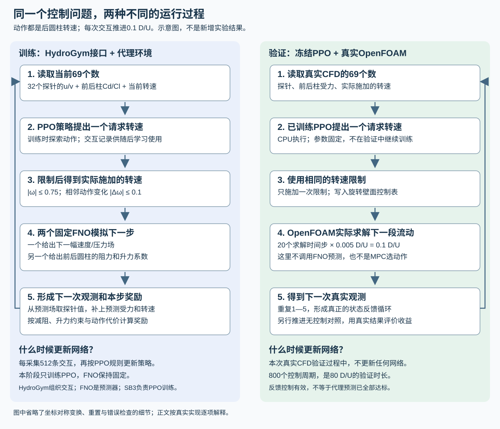

# 串列圆柱代理建模与真实反馈控制：工具栈与实现详解

> 2026-10-07只读技术说明；不授权训练、PPO、CFD、转换或晋级。范围仅为Re=100、L/D=5、后圆柱旋转案例。

## 0. 先记住：两种网络、三种“步”

本项目最容易混淆的是FNO和PPO。

- **FNO看整幅流场**：输入是`6×128×256`个数。它回答“给定现在的流场和动作，下一时刻的流场与受力可能是什么”。
- **PPO只看69个数**：64个尾流探针速度、前后圆柱各两个力系数、当前转速。它回答“根据传感器读数，下一步转多少”。
- **真实部署不运行FNO**：PPO仍看同样语义的69个数，但由真实OpenFOAM探针和受力文件提供。

三种步数：OpenFOAM `solver step=.005 D/U`；控制/代理`feedback step=.1 D/U`，等于20个solver steps；PPO optimizer step是一次Adam更新。epoch、LBFGS closure、H100递归步都是别的计数。

## 1. 一帧真实数据怎样走完整条链

### 1.1 OpenFOAM先产生真值

以`t*=120.1`为例。OpenFOAM v2512从120.0 restart开始，目录含`U,U_0,p,phi,phi_0,uniform/time`；`constant/polyMesh`定义网格，`system`定义`pimpleFoam`和`.005 D/U`步长。

后圆柱`rotatingWallVelocity`表给出120.0到120.1的角速度变化。20次solver step后写出：

- 整个求解网格的速度`U`和压力`p`；
- 32个固定尾流位置的三分量速度；
- 前、后圆柱各自的阻力系数`Cd`和升力系数`Cl`；
- pressure/viscous受力分量、时钟和solver日志。

这些才是物理真值；PhysicsNeMo、HydroGym和PPO都不生成它。

### 1.2 foamToVTK只转换格式

```text
foamToVTK -case <readonly-view> -fields '(U p)' -no-boundary -name <output>
```

它把OpenFOAM场转成VTK，不训练模型、不改变物理值。项目保存VTK float64 `TimeValue`；force和omega按该时钟插值，不能先降成HDF float32时间再倒推。

### 1.3 Curator把不规则网格整理成固定图片

PhysicsNeMo Curator提供`Source → Filter → Sink`和`VTKSource`。项目代码：

1. `Source`绑定VTK、原始force、omega和配置路径；
2. `VTKSource`读取真实网格`U,p`；
3. 项目Filter在`x=8..25,y=4..11`采成`128×256`规则网格；
4. 项目Sink写HDF、case/split属性和来源manifest。

每个像素有`u,v,gauge-p`三张图；另有`mask`，流体为1、圆柱内部为0。Curator是ETL框架，不是CFD；ROI、时钟、标签、质量门和HDF字段是项目实现。

### 1.4 HDF一帧有什么

| 名称 | 单帧shape | 通俗含义 |
|---|---:|---|
| `state` | `[3,128,256]` | u、v、去均值压力三张图 |
| `mask` | `[1,128,256]` | 哪些像素是流体 |
| `omega` | 标量或`[1]` | 端点实际施加的后柱转速 |
| `force` | `[4]` | 前柱Cd、前柱Cl、后柱Cd、后柱Cl |
| `time` | 标量或`[1]` | 无量纲时间`t*=tU∞/D` |

“四力”不是四个方向，而是**两个圆柱×每柱Cd/Cl**。下一帧force是当前输入之后的监督目标。根目录另有train-only normalization和manifest。

### 1.5 HDF5Reader/DataPipe怎样得到6通道

官方`HDF5Reader`只按帧读HDF为CPU tensor。项目`TandemWindowDataset`：

1. 读当前和下一`state`；
2. 用train-only mean/std归一化并乘mask；
3. 把当前omega铺成`[1,128,256]`常数图；
4. 把下一omega也铺成一张图；
5. 拼`[state3,mask1,omega_now1,omega_next1]`=`[6,128,256]`。

目标是`delta=normalized(next_state)-normalized(state)`的3张图和下一端点force4。H100返回起始场、后续100张真值场、101个动作端点、100组前后圆柱阻力与升力系数标签。Reader负责IO；项目DataPipe定义窗口、mask、动作时序和归一化。

## 2. FNO到底做什么

项目用PhysicsNeMo 2.2.2官方二维FNO/checkpoint API，基本`Cin=6,Cout=7`：

- 输出0:3是状态增量；`q_next=(q+delta)*mask`，不是直接下一状态；
- 输出3:7是四个力的空间读出图，mask内平均并反归一化为Cd/Cl。

保留B是双分支：冻结K1负责未来流场，气动力分支负责前后圆柱的阻力与升力系数。组合wrapper分别准备两支输入；当前B的K1气动力输入历史长度为1，只含当前一帧场、mask及当前/下一转速。通用wrapper支持更长场历史，不表示B实际使用62帧；62点受力历史属于奖励统计。训练编排、H1/AR loss、冻结及manifest是项目代码；PhysicsNeMo负责官方FNO层和checkpoint。

模型检查shape、finite、mask、normalization SHA、架构、epoch、source/runtime SHA、precision和fresh reload。能加载不等于预测准入；保留B完整代理精度仍未通过。



上图先区分两条实际过程：训练PPO时由冻结FNO快速产生下一观测；部署时由真实OpenFOAM产生下一观测，在线不调用FNO。图为方法示意，省略24起点reset循环、动作方向变换及部分审计细节；精确行为以第4、5、7节正文为准。

## 3. HydroGym到底是什么

HydroGym不是OpenFOAM，不训练FNO，也不是PPO算法。它是**环境外壳**：把“状态、推进一步、观测、奖励”组织成Gymnasium的`reset()`和`step(action)`，让SB3调用。

项目向`FlowEnv`提供：

- `Full40CanonicalSurrogateFlow`：保存预测场、mask、前后圆柱阻力与升力系数、omega、时钟、探针和reward history；
- `TandemFNOStepper`：限幅动作、调用双FNO角色、更新场/力/history；
- 项目wrapper：检查观测、reward组成、episode终止及日志。

HydroGym负责标准调用顺序；物理对象、FNO推进、reward、身份和安全门均是项目代码。

<a id="hydrogym-explained"></a>

## 4. HydroGym一次reset/step的真实过程

### 4.1 E082为什么能使用H5

通用`Full40CanonicalRewardAudit`要求`max_steps≥100`，**E082没有把它直接改成5**。E082不可变runtime实际导入项目`exploratory_h5_hydrogym.py`：先用`FlowEnv + Full40CanonicalSurrogateFlow + TandemFNOStepper`构造`max_steps=5`的raw环境，再套`ExploratoryH5Audit`专用wrapper。该wrapper明确检查H5时钟、62点history和`scientific_admission=False`，而不是调用原100步admission wrapper冒充通过。

### 4.2 E082的24个真实reset起点

E082不是只从四条zero轨迹的frame0反复开始。训练先为四个phase `b00,b02,b04,b06`各建一个raw H5环境；每个phase外再套`wrap_phase_cycle`，独立按固定六槽循环：

```text
zero/frame0 → m075/frame62 → m0375/frame62
            → zero/frame62 → p0375/frame62 → p075/frame62 → 重复
```

所以reset panel共有`4 phase×6 start=24`个已验证真实起点。初次构造raw环境只建立FlowEnv/FNO对象和anchor；真正交给SB3的首次`reset()`会显式安装该phase的slot0 `zero/frame0` packet。每个五步episode截断后，`DummyVecEnv`保存刚结束episode的`terminal_observation`，随即调用同一phase wrapper的下一槽reset；不能把自动reset后的新观测误当上个episode末态。

每个packet的安装过程是：

1. 从对应HDF frame读真实起始场、mask、前后圆柱的阻力与升力系数、omega；
2. frame0从原始restart来源、frame62从该受控轨迹自身force文件读取截止起点的62个真实受力样本；
3. 核history最后一个force与该packet的原始force端点一致；
4. 建立K1当前态buffer；另把62点真实受力历史装入奖励ledger，不把它冒充FNO场历史；
5. 从起始场双线性插值32个探针u/v；
6. 返回69维观测，并在`info`记录phase、case、frame和六槽索引。

四个phase各自维护六槽计数；终态审计得到每个phase `[274,273,273,273,273,273]`。四个初始reset加6552个完成episode，对应6556次reset调用。

62点要求仅属于canonical因果reward/H5 wrapper，不泛化到旧rear-only或所有`TandemSurrogateFlow`。

### 4.3 69个数字逐项是什么

```text
0..63 : 32个位置，每处依次u,v
64    : 前圆柱Cd
65    : 前圆柱Cl
66    : 后圆柱Cd
67    : 后圆柱Cl
68    : 当前实际施加omega
```

前四个数是probe0的`u0,v0`和probe1的`u1,v1`，不是网格像素。旧rear-only接口只有67维，不能加载69维policy。

### 4.4 step完整故事

1. PPO读69数，输出一个请求转速；
2. 项目限制`|omega|≤.75`及相邻`|Δomega|≤.1`；
3. 当前场、mask、旧/新动作进入冻结K1流场FNO；
4. B气动力FNO采用K1：只输入当前这一帧场、mask以及当前/下一转速，不把62点受力历史或62帧流场送进FNO；
5. wrapper得到下一场增量，以及前后圆柱的阻力与升力系数，更新场、FNO当前态和`t+0.1`；
6. 从预测场插值32个u/v，拼上前后圆柱的阻力与升力系数和omega，成为下一组69数；
7. 因果受力窗产生六项cost和reward；
8. `FlowEnv`返回`obs,reward,terminated,truncated,info`，SB3存入buffer。

训练时69数来自**FNO预测场/力**；真实部署时相同69维来自**OpenFOAM probes/forceCoeffs**。FNO负责模拟未来，PPO负责选动作。另存的62点真实/预测受力历史仅用于计算因果奖励中的均值、波动和偏置统计，不属于69维观测，也不是气动力FNO的输入序列。

### 4.5 H5五步episode

H5即每个episode推进5个feedback steps=`.5 D/U`，之后切换到该phase六槽循环中的下一个真实packet，而不是总回到frame0。每个packet都自带与其起点匹配的62点真实history。H5限制代理误差累积和训练成本，不证明H100精度，也不是最终80 D/U CFD。

reward窗中真实history逐步被预测样本替换：第1步1个预测样本，第5步5个；没有读取未来真实force。

<a id="ppo-training"></a>

## 5. PPO网络与E082训练计数

### 5.1 保存模型核出的actor/critic

E082保存zip的`policy_kwargs={}`，但架构由`policy.pth`权重shape和锁定SB3 2.7.1源码共同确认：

- actor：`69→64→64→1`，两个隐藏层Tanh；
- critic：独立`69→64→64→1`，两个隐藏层Tanh；
- actor给一维高斯均值，另有可学习`log_std[1]`；
- 连续动作使用`DiagGaussianDistribution`，不是离散分类器或SAC的tanh-squashed分布；
- action space为`[-.75,.75]`，项目之后还有速率filter；
- critic输出标量价值，只在训练时帮助估计优势，不直接驱动圆柱。

### 5.2 参数和用途

| 参数 | E082值 | 用途 |
|---|---:|---|
| environments | 4 | 四个phase环境实例；每个实例独立轮换六个reset槽 |
| `n_steps` | 128 | 每环境每轮收128步 |
| rollout size | 512 | `4×128`条后训练 |
| `batch_size` | 256 | 每epoch分两批 |
| `n_epochs` | 4 | 同一rollout学习4遍 |
| learning rate | `3e-4` | Adam更新幅度 |
| gamma | `.99` | 未来reward折扣 |
| GAE lambda | `.95` | 优势估计偏差/方差折中 |
| clip range | `.2` | 限制policy变化 |
| entropy coef | `0` | 无额外熵奖励 |
| value coef | `.5` | critic loss权重 |
| max grad norm | `.5` | 梯度裁剪 |
| episode length | 5 | `.5 D/U`代理episode |
| seed | `20261007` | E082固定随机种子；不等于独立多种子统计 |

### 5.3 32768、64、256、512分别是什么

- 32768 transitions；每轮四环境共512，所以64轮rollout。
- 每轮512、batch256：每epoch 2个minibatch。
- 每轮4 epochs：`2×4=8`次真实Adam step。
- 64轮共512个optimizer hooks，独立审计逐一核过。
- SB3 `_n_updates=256`按PPO epoch累计，即`64×4`，不是Adam调用次数。
- 实际日志有6552个完整五步episode；不能用`32768/5`把尾部边界当完整episode。

这里的“4环境”是SB3 `DummyVecEnv`在同一进程中按索引顺序调用四个环境函数，并非四块GPU或四个真正并发求解器。它们分别绑定`b00,b02,b04,b06`，vector step每次依序推进四个实例；独立终态审计检查了这一固定顺序。

`ep_rew_mean`是代理H5 reward，`value_loss`是critic误差，都不是OpenFOAM减阻率。物理结果必须另跑冻结policy配对CFD。

## 6. reward奖惩什么

canonical reward是项目代码，不是HydroGym/SB3默认：总阻力改善、未达2%减阻惩罚、后柱Cl波动比超过1.05惩罚、平均Cl偏置超过baseline波动10%惩罚、`0.01(omega/.75)^2`、`0.01(delta_omega/.1)^2`。即时reward为六项cost和乘`-.1`；`gamma=.99`只做跨步折扣。

## 7. 真实部署与代理训练的区别

冻结`policy.zip + VecNormalize`在CPU加载。每`.1 D/U`：从真实case读32 probes和前后forceCoeffs，组成69维；一次`policy.predict`并过滤动作；写旋转表；真实`pimpleFoam`推进20步；再读新69维并推进zero分支。

新配对control/zero从匹配初态出发；E109/E114连续恢复分别使用受控、zero自身restart，不能把受控分支重置成zero。部署不调用FNO、不更新PPO、不是MPC。约1.37秒/feedback不证明硬实时，动作平方成本不是净节能。

## 8. 工具职责速查

| 工具 | 做什么 | 不做什么 |
|---|---|---|
| OpenFOAM | 真实场、探针、受力 | 不训练FNO/PPO |
| foamToVTK | U/p转VTK | 不采ROI、不改真值 |
| Curator | ETL框架 | 不自动定义项目标签 |
| HDF5Reader | 按帧读CPU tensor | 不做窗口/物理对齐 |
| 项目DataPipe | mask、normalize、6通道、H100 | 不产生CFD |
| PhysicsNeMo FNO | 官方算子/checkpoint | 不提供reward/PPO/CFD桥 |
| HydroGym | reset/step生命周期 | 不是solver或trainer |
| Gymnasium | Env/space/终止API | 不定义物理 |
| SB3 PPO | actor/critic、rollout、优化 | 不验证控制收益 |
| 项目桥 | 真实69维、动作filter、分段CFD | 不在线训练policy |

## 9. 检查、资源与版本治理

数据检查字段/shape/finite/时钟/force/omega/split/normalization；模型检查SHA、通道、precision和fresh reload；环境检查69维、动作、history、FNO冻结和reward；部署检查probe坐标、force列、restart和容器身份。仅对合同实际读取的数据做finite检查，不声称每solver step全网格独立复查。

Git存source/config/tests/approval/report/SHA；HDF、VTK、case、checkpoint、PPO zip、VecNormalize和镜像留Spark。每次运行唯一unit/invocation/output。

DGX Spark为统一内存；保持`MemAvailable≥20 GiB`，常用startup50/runtime22 GiB门。GPU0、allocator/cgroup、noSwap、CPUQuota、timeout和disk reserve由批准绑定。

锁定运行时不是“当前最新版本”的同义词：

| 组件 | 本项目实际绑定 |
|---|---|
| OpenFOAM | v2512容器及批准中的image digest |
| PhysicsNeMo | 2.2.2；官方FNO/checkpoint/HDF5Reader |
| PhysicsNeMo Curator | 0.1.0独立py312环境 |
| Stable-Baselines3 | 2.7.1 vendored runtime |
| HydroGym | commit `4ab9854dea3d84e38a59c25e0f5835a00cf8225f` |
| PyTorch / h5py | 通用锁文件记录2.14.1 / 3.16.0；执行仍以approval runtime SHA为准 |

## 10. 安全预检、外部依赖与官方资料

```bash
cd /workspace/fluid_control
python3 scripts/reproduce_canonical_closed_loop.py
```

预期`PREFLIGHT_PASS_NOT_RUNNING`；不创建输出、不启动CFD。执行需新approval/unit/空output；本文不授权`--execute`。Git clone还缺HDF、normalization、K1/B checkpoint、E082 policy/VecNormalize、restart和镜像；索引见最终模型清单及canonical inventory。

2026-10-07核对的官方资料；`latest/master`只解释API，项目以锁定版本/SHA为准：

- FNO：<https://docs.nvidia.com/physicsnemo/latest/physicsnemo/api/models/fnos.html>
- Reader/DataPipe：<https://docs.nvidia.com/physicsnemo/latest/physicsnemo/api/datapipes/physicsnemo.datapipes.readers.html>
- Curator：<https://docs.nvidia.com/physicsnemo/latest/user-guide/curator.html>、<https://github.com/NVIDIA/physicsnemo-curator>
- HydroGym：<https://github.com/dynamicslab/hydrogym>、<https://dynamicslab.github.io/hydrogym/>
- Gymnasium：<https://gymnasium.farama.org/api/env/>
- SB3 PPO：<https://stable-baselines3.readthedocs.io/en/master/modules/ppo.html>
- OpenFOAM：<https://doc.openfoam.com/2312/tools/processing/boundary-conditions/rtm/derived/wall/rotatingWallVelocity/>、<https://doc.openfoam.com/2606/tools/post-processing/function-objects/forces/forceCoeffs/>

### 10.1 E082关键源码证据索引

以下路径均由E082批准逐字节绑定；短SHA仅为阅读定位，完整清单仍以approval为准：

| 职责 | 不可变路径 | SHA-256 |
|---|---|---|
| H5 raw环境 | `artifacts/exploratory_h5_ppo_source_20261006_immutable/scripts/exploratory_h5_hydrogym.py` | `cfda96c4...e0532` |
| 24起点/六槽reset | `artifacts/exploratory_diverse_h5_ppo_source_20261006_immutable/scripts/exploratory_diverse_h5_resets.py` | `a01c0af6...65319` |
| E082训练编排 | `artifacts/exploratory_diverse_h5_ppo_source_20261006_immutable/scripts/train_exploratory_diverse_h5_ppo.py` | `aae8c9a4...f3040` |
| 因果reward | `artifacts/exploratory_h5_ppo_source_20261006_immutable/src/fluid_control/canonical_joint_v1.py` | `138ab2b4...e8bd` |
| 通用canonical环境 | `artifacts/exploratory_h5_ppo_source_20261006_immutable/src/fluid_control/full40_canonical_hydrogym.py` | `ca64f7c0...5395` |
| HDF/DataPipe | `artifacts/exploratory_h5_ppo_source_20261006_immutable/src/fluid_control/tandem_datapipe.py` | `c939e455...3ae` |

E082 canonical训练证据见[P064_B_SYMMETRY_CANONICAL_PPO_TERMINAL_REVIEW_20261007.md](P064_B_SYMMETRY_CANONICAL_PPO_TERMINAL_REVIEW_20261007.md)；默认交付策略血缘和大文件位置见[FINAL_MODEL_AND_REPRODUCTION_MANIFEST_20261007.md](FINAL_MODEL_AND_REPRODUCTION_MANIFEST_20261007.md)。通用`full40`代码与E082专用H5/diverse-reset包装器必须一起阅读，不能只拿通用环境推断实际训练reset行为。

## 11. 当前结论

已实现并审计：真实CFD→VTK→Curator/HDF→Reader/DataPipe→官方FNO→HydroGym/SB3 PPO→冻结CPU policy→真实OpenFOAM反馈。限定工况B闭环通过物理门。

未完成：完整代理精度、跨工况泛化、有效FNO-MPC、网格/时间步独立性、硬实时和净能耗。H5 reward下降、工具链连通或训练loss下降都不能替代科学准入。
