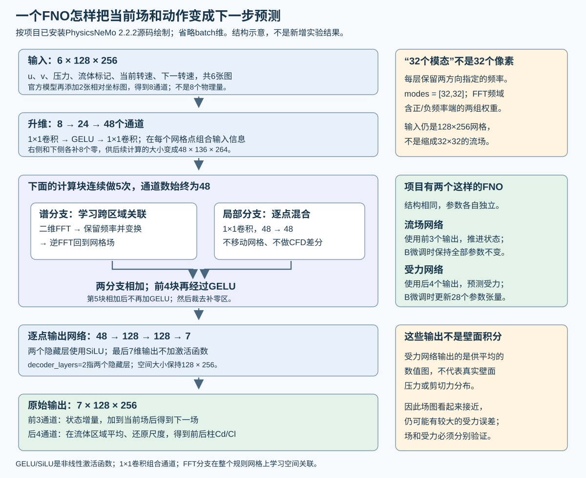

# 代理模型技术设计：从CFD数据到双FNO训练与可靠性验证

2026-10-07修订。面向理解CFD、但不熟悉神经网络训练实现的读者。
本文解释实际保留模型B，并提出未执行的后续诊断；不批准新训练、推理或CFD，不更换默认策略。

## 1. 为什么需要代理

真实OpenFOAM提供物理真值，但强化学习反复尝试动作，直接进行大量CFD交互成本高。
代理学习近似映射：“当前流场＋当前/下一转速 → 下一流场及圆柱受力”，作为离线策略学习环境。
策略在代理中训练后冻结，回到真实CFD验证。本项目实际部署由CPU PPO读取真实观测，不逐周期运行FNO。
必须分别回答：预测是否准确、策略是否学到可用动作、真实CFD控制是否有效。这三件事不能互相替代。
本case为Re100、中心距L/D5的两个固定中心圆柱，仅后柱旋转；无结构运动方程，不是涡激振动验证。
保留B的真实PPO闭环已通过原物理门，B完整气动力预测仍未通过。链路贯通不等于全部科学目标完成。

## 2. 网络看什么、预测什么

### 2.1 相邻时间对与张量

CFD积分步长0.005 D/U；学习帧/控制反馈间隔0.1 D/U，即20个CFD步。
以下n表示学习帧。128×256是规则ROI采样网格，不是OpenFOAM非结构网格。

| 数据 | 不含batch的形状 | 解释 |
|---|---|---|
| 当前流场q_n | 3×128×256 | u、v、gauge pressure，按训练统计标准化 |
| 流体mask | 1×128×256 | 流体1、圆柱内0；标准化后再mask |
| 当前转速ω_n | 1×128×256 | 当前端点动作除action_scale，广播为空间常数 |
| 下一转速ω_(n+1) | 1×128×256 | 区间已指定的动作端点，不是未来真实场 |
| 完整输入 | 6×128×256 | 上述3＋1＋1＋1通道 |
| 网络原始输出 | 7×128×256 | 前3通道场增量；后4通道受力读出图 |
| 下一受力标签 | 4 | 前柱Cd/Cl、后柱Cd/Cl，时刻为n+1 |

ROI为x=[8,25]、y=[4,11]；没有壁面法向、逐面面积或壁面剪切张量。
四个集成力标签来自真实CFD受力记录，不能从这些标签唯一反解真实局部牵引。
动作是保存的实际端点值，不应把名义PRBS在舍入时间上重插值后当同一数据。
action_scale来自绑定manifest，不应把部署上限0.75硬当所有数据集的标准化尺度。

### 2.2 标准化与还原

流场：`z_j=(q_j−μ_j)/σ_j`，再乘mask；受力：`y_k=(F_k−μ_F,k)/σ_F,k`。
全部μ/σ来自批准的train统计并保持原字节；开发集不参与拟合这些统计。
物理预测：`Fhat_k=σ_F,k*yhat_k+μ_F,k`；物理误差：`σ_F,k*(yhat_k−y_k)`。
不同通道相同normalized误差不代表相同物理误差；不同σ也改变损失对物理误差的曲率。
这不是参数梯度或Adam更新大小的直接证据。固体mask零值也不是供模型拟合的流体真值。

<a id="model-network"></a>

## 3. 一个官方FNO内部怎样计算

本次直接读Spark已安装PhysicsNeMo 2.2.2的FNO、二维encoder、谱卷积和decoder源码，没有构造/运行模型。
顶层官方FNO源码SHA与历史批准版本相同，具体证据见末节。



两个FNO结构相同但权重独立；此图说明计算流程，不是新的性能结果。

### 3.1 实际逐层路径

```text
项目输入 [batch,6,128,256]
 → 官方追加2个相对坐标平面 [batch,8,128,256]
 → 1×1升维卷积8→24 → GELU → 1×1升维卷积24→48
 → 高度/宽度末端各补8个零 [batch,48,136,264]
 → 5层“二维谱卷积分支＋局部1×1卷积分支”
      前4层相加后GELU，第5层相加后无GELU
 → 裁去padding [batch,48,128,256]
 → 每网格点独立decoder：48→128→128→7
      两个隐藏层SiLU，最终7维线性输出、无末端激活
 → [batch,7,128,256]
```

`decoder_layers=2`指两个隐藏层，**不是含最终输出在内只有两个线性层**。
官方坐标是沿两个数组轴的0..1相对坐标，不是直接加入物理x=8..25、y=4..11。
1×1卷积只混合同一点的通道；它与谱分支相加提供局部映射，不是CFD差分算子。

### 3.2 模态数、谱分支和边界

谱层对二维空间做rFFT，对保留系数进行可学习的通道混合，再逆变换回空间域。
实际SpectralConv2d有两组权重，分别作用于第一轴正/负频率端32行与第二轴rFFT前32列。
`modes=[32,32]`不是32×32空间网格，也不是只允许32种流动形态。
每层两组权重形状为`[48,48,32,32,2]`，末维2为复数实/虚部；局部分支及非线性仍处理完整网格。
padding=8在右/下侧补零，谱计算后裁掉；它处理有限域谱计算边界效应，不等于严格施加OpenFOAM边界条件。
GELU与SiLU引入非线性。本项目使用官方默认encoder GELU、decoder SiLU，不是自行设计激活。

### 3.3 “28个参数”不是28个数

一个网络有30个参数张量：升维层4、五个谱层10、五个局部卷积10、decoder6。
B训练其中28个张量，冻结两个升维bias；每个谱权重张量本身包含大量标量。
按上述已核官方源码与当前配置逐层计算，单个FNO共有 **47,222,783个实数参数标量（约47.22M）**：

| 部分 | 参数标量数（含bias） |
|---|---:|
| 升维8→24→48 | 1,416 |
| 五个谱层，两组复权重/层 | 47,185,920 |
| 五个48→48局部1×1卷积 | 11,760 |
| decoder 48→128→128→7 | 23,687 |
| 单网络合计 | 47,222,783 |

谱层计数为`5×2×48×48×32×32×2`，最后的2已计实部/虚部，不应再乘一次。
两个独立网络合计94,445,566个标量；B仅训练气动力网络，冻结24＋48个升维bias标量，因此可训练标量为47,222,711。
这是**官方源码shape与配置推导**，不是本轮重新加载checkpoint逐tensor求和；不包含优化器状态、激活、FFT临时缓冲或显存开销。
两个网络架构相同，但权重独立、职责不同，不是同一个FNO临时换输出头。

## 4. 流场网络与气动力网络怎样连接

流场网络输出归一化增量，按`z_(n+1)=(z_n+delta_z)*mask`更新，不直接把前三输出当下一场。
气动力网络的后4输出做流体mask内空间平均：

```text
yhat_k = sum_xy(mask * raw_force_channel_k) / sum_xy(mask)
Fhat_k = μ_F,k + σ_F,k * yhat_k
```

这是学习的集成力映射，不是预测真实壁面pressure/shear后积分。
两个FNO都实际计算7输出；flow的受力输出不用来训练aero，aero的前三场输出不用于状态推进。
不能把这说成只计算3通道/4通道的精简网络。
训练B时flow完全冻结，无梯度生成预测状态序列。
aero冻结`spec_encoder.lift_network.0.conv.bias`、`.2.conv.bias`，其余28张量训练。
英文lift在此是“升维”，不是物理升力；不是冻结前后柱Cl输出偏置。
预测受力不回填为flow输入，也不输入真实当前force，避免用force直接作预测捷径。

## 5. 为什么同时训练真实状态一步预测与连续预测

101帧窗口`q_0..q_100`与101动作端点对应100个下一受力标签`F_1..F_100`。
H1支在每个n使用真实q_n预测F_(n+1)，即100个独立于预测状态误差的一步任务。
AR支从真实q_0开始，由冻结flow递推qhat_1..qhat_99，aero在这些预测current状态上预测下一力。
两支使用同一保存动作序列与真实下一force；AR除起点外不重置真实状态。
目的在于使aero既能读真实场，也接触flow代理在实际递推中产生的输入误差。

每支目标是标准化力误差：
`L=.125*MSE(frontCd)+.125*MSE(frontCl)+.125*MSE(rearCd)+.625*MSE(rearCl)`。
每个MSE在100端点平均；完整窗口`L_window=.5*L_H1+.5*L_AR`。
这是受力预测误差，不是PPO奖励、真实减阻率或机械功率。
使用PhysicsNeMo不表示本次B训练自动采用Navier–Stokes残差、PINN或严格守恒约束：实际目标只有这里列出的受力监督，流场网络冻结。未来增加物理残差属于新的项目损失和待验证方案，不是当前已有能力。
100端点分10块；每块10个H1与10个AR输入拼成一次batch20，块loss乘.1再反向。
分块不是只评价10步，也不是每10步将flow重置成真值。

<a id="model-training"></a>

## 6. 当前B精确训练配置及作用

| 项目 | 实际配置 | 为什么这样记/改变有什么影响 |
|---|---|---|
| 初始化 | 已训练FC-P026-K1 | 继续微调已有映射，不是随机从零训练 |
| 数据来源 | 原44轨迹＋controlled-b00 | 开环和控制访问状态，须分来源评价 |
| 调度 | 256窗＝192 original＋64 b00 | b00占1/4，8窗组位置0/4替换 |
| 窗口步幅 | base20/train8/train16/b00为20/2/2/1 | 学习帧索引间隔，决定重叠，非solver dt |
| 单窗时域 | 100转换＝10 D/U | 递推长度，不是100次更新 |
| DataLoader batch | 1窗，shuffle=False | 保留预声明顺序 |
| aero内部batch | 10 H1＋10 AR＝20 | 每窗10次调用，非20条独立轨迹 |
| 累积窗口数 | 8 | 原梯度累积后除8，再更新一次 |
| 优化器 | fresh AdamW | 从K1权重开始但不继承上游Adam动量 |
| learning rate | 1.5625e−7 | 更新尺度，小lr不证明32步充分拟合 |
| betas / eps | .9/.999；1e−8 | 梯度一/二阶统计与分母稳定项 |
| weight decay | 1e−4 | 解耦权重衰减，权重变化不全是数据梯度学习 |
| clip | 平均梯度全局L2上限1 | 每8窗裁一次，非各窗分别裁 |
| optimizer更新 | 32＝256/8 | 32次参数更新，非32epoch |
| seed | Python/NumPy/Torch/CUDA均20261003 | 配合数据顺序保证复现，不替代身份检查 |
| precision | float32、high、CUDA/cuDNN TF32开 | 历史B协议，不与highest缓存混比 |
| 诊断 | 训练前后各6个固定原训练窗 | 不更新参数，检查旧窗口能力，不是dev |

一个累积组的顺序：清梯度→依次8窗反向→梯度除8→有限性检查→一次clip→一次AdamW更新。
缺窗或非有限即失败，不跳过困难样本；重复窗口和相邻端点也不宣传为独立样本。

## 7. 一次B训练的逐项计算账

以下是按已执行源码控制流及256窗/32更新完成记录推导的调用数，不是GPU profiler测量。
每次`run()`调用`frozen_flow_states()`，内部100次flow前向；没有跨窗口持久缓存省掉这些调用。
本窗100个current状态暂存在内存给aero使用，是临时缓存，不是跨窗预计算库。
实现还计算qhat_100，但返回current序列只含q_0..qhat_99；最后生成状态不再作本窗后续输入。

| 项目 | 每个训练窗口 | 256个训练窗口 | 梯度/更新 |
|---|---:|---:|---|
| flow模块前向 | 100次，batch1 | 25,600次 | 无梯度、权重冻结 |
| aero模块前向 | 10次，batch20 | 2,560次 | 建立aero梯度图 |
| aero受力样本数 | 200个四系数向量 | 51,200个向量 | 不等于optimizer步数 |
| backward调用 | 10次 | 2,560次 | 在8窗组内累积 |
| optimizer.step | 每8窗1次 | 32次 | 真正参数更新 |

训练前6窗＋训练后6窗仍走同一run但不反向：额外1,200次flow、120次batch20 aero、2,400个受力向量。
合计训练与这两组诊断：26,800次flow＋2,680次aero＝29,480次模块forward调用。
不含后续独立正式评价、PPO训练或失败任务；官方checkpoint加载本身不是模型forward。
32次更新是有界256窗调度，不是遍历全部原始帧；checkpoint的epoch数字也不能直接当数据遍历次数。

## 8. 可核验的上游训练沿革

| 阶段 | 起点/角色 | 本次能确认的预算/事实 |
|---|---|---|
| FC-P003C | P009方案绑定的早期epoch2父本 | 本次未重核其完整训练步数，不填推测数 |
| FC-P009 | 后续链使用其epoch0 flow权重；有force-row校准历史 | P026源码审查明确流场父本P009；不把epoch0当零训练 |
| FC-P018 | 气动力上游，flow与两升维bias冻结 | 44 HDF、1,368有序窗、171个8窗AdamW更新，lr1.5625e−7 |
| FC-P026-K1 | flow取P009；aero从P018继续，历史长度1 | 1,368窗、171更新，官方双模型reload通过 |
| FC-P064-B | K1权重初始化，加入受控b00 | 256窗、32次fresh AdamW更新，flow不变 |

因此B不是32步随机训练完整代理。不同阶段优化器/数据不同，不能把171＋171＋32称作同一连续Adam训练374步。
P018/K1工程通过不等于完整预测合格。上游总训练成本未完整重核，本文不提供虚构总epoch数。
依据：`FC_P018_TERMINAL_REVIEW`、`FC_P026_TRAINER_CPU_REVIEW`、`FC_P026_K1_TERMINAL_REVIEW`及B实际manifest。

## 9. 分层评价：每一层只能证明该层

1. 工程层：时钟/数据、梯度、冻结项、官方保存/重载、资源正确；退出0不等于准确。
2. 训练内：固定点的四系数误差；Representative256每通道normalized RMSE≤.01仅是该面板拟合目标。
3. 原六窗保持性：B和候选同precision、同6起点、H1及连续AR100，原双项均不退化AND不改。
4. 开发/正式预测：固定16起点×H1–H5及原force-window/H100按各自协议；已打开开发相位不是新独立测试。
5. 真实CFD：独立批准、同restart配对zero、同动作限制/窗口与原物理门；预测失败下探索须单独标明，非模型晋级。

场指标报告mask内u/v/p逐通道relative L2、absolute RMSE、偏差及真/预测/误差图；近零分母另报绝对值。
受力指标报告四系数MAE/RMSE/均值、后柱升力去均值RMS和漂移；totalCd误差先求两Cd误差之和再absolute。
相位/PSD需足够长、等采样的固定窗，预声明去均值/窗函数/频率分辨率；不通过事后相位移动隐去原误差。
H5=.5 D/U不足当完整周期频谱证据。动作价值需同q0/真实历史的多动作CFD真值、所有pair差值/tie/regret。
已发生动作回放不是反事实排序；缺62点历史不得伪造原reward，endpoint cost与gamma=.99回报分开。

真实物理门保持：总平均减阻≥2%；rearCl去均值RMS/zero比≤1.05；`abs(meanCl_controlled)/std(Cl_zero)`≤.10。
偏置不是两支均值差，也不除以meanCl。omega²不是机械功率，未测扭矩不能称净节能。

## 10. 已有失败及下一步诊断（未执行）

纯H1 F、Absolute64、AR5 reset、反射、压力辅助、时间增量辅助及晚期覆盖I已经尝试，不更名重复。
I原六窗改善而dev退化；真状态替代也不支持单独归因flow误差。
40/256点LBFGS预算停止时仍下降，未达.01不能证明容量不足或收敛。
Representative256训练loss下降70.84%，同precision六窗H1/AR却退化15.8169%/14.2703%，候选拒绝。
b00的64点贡献rearCl/totalCd改善87.3%/98.7%，所选train8的45点四系数全部变差，旧三family前柱力也退化。
这是来源/通道权衡与选点外失败共存证据，不能区分采样稀疏、梯度干扰、参数漂移。

未来先复用saved数组，不为同结论重复推理；每项新实验预先固定唯一变量、预算、停止规则与反例。
若检验来源梯度干扰：固定B、train-only各来源等量小面板、原目标/precision，一次无更新Gram/cos，另报原比例合梯度。
建议该诊断上限10分钟GPU、0optimizer/0save，须另批；方向一致则反驳该面板干扰假设，不继续盲改权重。
若检验覆盖：固定总样本/forward预算、训练数据池与评价，只改预声明抽样；不借dev反复调整配额。
若检验归一化/读出：先核物理换算、压力/黏性组成、mask归约和真实参数梯度；1/σ²曲率比不证明梯度主导。
已有单窗loss-scale probe不支持前柱Cd必然主导；新来源梯度问题与它不同，但也不能直接证明Adam更新行为。
排查时钟/标签/优化/覆盖后才讨论容量；不得因尚未拟合就默认增层、增modes、扩大batch。

## 11. 3D、模态和batch仅是有条件方案

安装官方源码支持dimension=3，但二维case不能因此称为三维物理。时间当第三轴是时空算子，须严格因果切窗。
多历史帧改变输入通道与checkpoint合同，须先查已有K4实验，不冒充原K1。
增加modes先核采样/Nyquist、mask几何、padding与参数量；更多频率参数不能恢复输入未包含的真实壁面信息。
更大microbatch若仅工程改动须保留全panel权重：256点25×10＋6时末batch为6/256，不能26个batch等权。
吞吐、closure数、更新数、effective batch是不同变量，不一次全改后称单因素改善。

## 12. 复现与本次源码证据

train统计不由dev重拟合；case/start/lead/action/target/历史逐项绑定，重复保留，不删除困难点。
保存初值、终值和接受点；线搜索trial不当最佳候选，预算异常恢复参数/optimizer/grad事务。
官方save/freshreload、独立保存数组审计与新的forward是不同证据；场/力/mask/坐标/time/action都应保存供复算。
Git只存源码/配置/报告/清单；大HDF/checkpoint/CFD留主节点。旧approval不是新运行许可。

官方根：`.venv-curator-py312/lib/python3.12/site-packages/physicsnemo/`。
已读`models/fno/fno.py`、`nn/module/fno_layers.py`、`nn/module/spectral_layers.py`、`models/mlp/fully_connected.py`。
FNO SHA `e64eb9bef031bfdae5d84f0ed35a1ebb27915f18aed4a333b2dd985a083c71a9`；encoder SHA `3d7a4c3a6f71358ef842d6f6c2ea642f4a95e02fdd3aed33a36b1525fbab0e2d`。
项目已读：`scripts/train_tandem_fno.py`、`src/fluid_control/tandem_datapipe.py`、`scripts/train_fcp013_independent_force_fno.py`、`scripts/p026_state_history.py`、`scripts/p026_history_objective.py`、`scripts/train_fcp015_window_accumulation.py`、`scripts/train_fcp064_controlled_aero_ab.py`。
B manifest `artifacts/fcp064_controlled_aero_arm_b_20261006/dual_model_manifest.json` SHA `92766915cb11ca75d313608a5f75e61a218371dcc789f5b44725f0a8260e7891`。
norm SHA `f1b4607e2eace8f8d3c2c9aa5dcfa642ed43f470ab62fe3e5c051cce0a292bc1`；实际历史执行仍以immutable闭包为准。
仍缺完整预测通过、可靠跨工况泛化、最终策略离散误差/公平对照、净能耗/物理实时性和有效优于B的FNO-MPC。
当前保留B真实闭环与全部负结果；新研究先解释一个可证伪问题，不靠更多计算替代验证。
