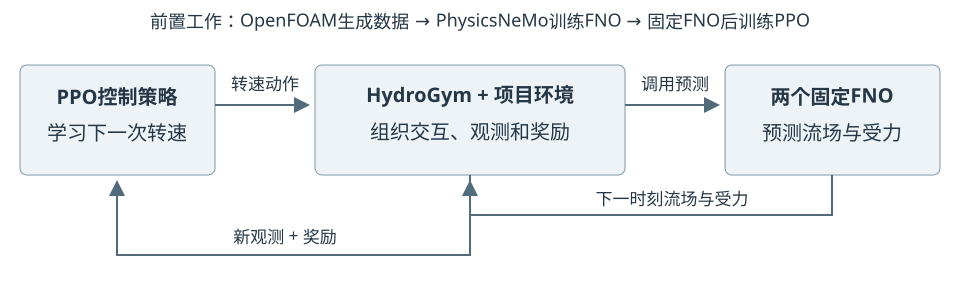
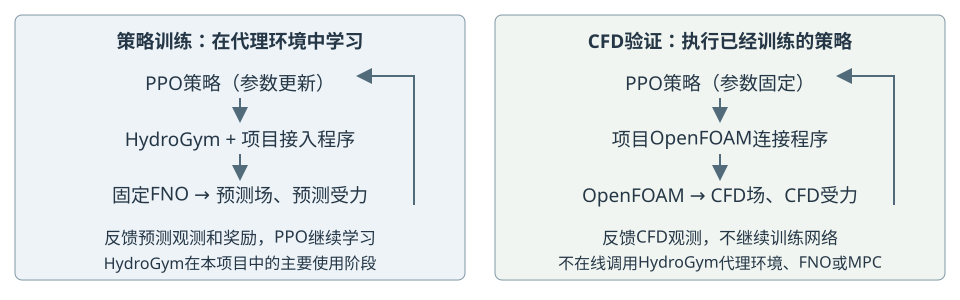

# HydroGym 与控制实现

## 软件分工

HydroGym 将流动计算组织成控制算法可以交互的环境：接收动作、推进状态、返回观测与奖励。本项目使用环境接口接入 FNO，不直接运行平台自带案例。FNO 是预测器，SB3 PPO 学习动作，OpenFOAM 提供真实数据与最终数值验证。

固定版本按 `PDEBase` 保存状态、`TransientSolver` 推进、`FlowEnv` 组织交互。`Full40CanonicalSurrogateFlow` 和 `TandemFNOStepper` 是项目适配程序；OpenFOAM 连接也由项目实现，不是 HydroGym 原生求解器配置。[固定版本接口](https://github.com/dynamicslab/hydrogym/blob/4ab9854dea3d84e38a59c25e0f5835a00cf8225f/hydrogym/core.py)

## 观测、动作与奖励

| 部分 | 实际实现 |
|---|---|
| 观测 | 69 个数：32 个探针的 u/v 共 64 个，前后柱 Cd/Cl 共 4 个，加当前转速 |
| 动作 | 后柱请求转速；经坐标对称处理及幅值/变化率限制后施加 |
| 转速约束 | ω*=ΩD/U∞，绝对值 ≤0.75，相邻变化 ≤0.1 |
| 推进间隔 | 0.1 D/U∞；真实验证对应 20 个 CFD 时间步 |
| 奖励 | 鼓励总减阻，惩罚升力波动、平均偏置、过大转速与动作变化 |
| 历史统计 | 62 个受力采样点计算均值和波动；不是 FNO 的 62 帧输入 |

奖励由项目代码定义，不由 HydroGym 自动选择。策略及动作处理作为整体接受验证，不能将收益全部归因于一个未隔离测试的组件。

## PPO 训练与 CFD 部署

每段从真实 CFD 状态开始，固定 FNO 连续推进 5 步，再换起点。使用 24 个起点与 4 个 `DummyVecEnv` 实例，在同一进程顺序执行，不代表四块 GPU 并行。

| 配置 | E082 canonical PPO |
|---|---|
| 网络 | Actor / critic 各为 69→64→64→1，Tanh；连续高斯动作 |
| 交互总量 | 32,768 条经验，64 轮采集 |
| 参数更新 | 512 次优化器更新；`_n_updates=256` 是累计训练 epoch |
| 采集与学习 | 每环境 n_steps=128；4 环境共 512 条；batch=256，4 epochs |
| 超参数 | 学习率 3×10⁻⁴，γ=0.99，GAE=0.95，clip=0.2 |

训练后固定策略，在 CPU 上读取真实 CFD 观测，把动作交给 OpenFOAM，再取得下一观测。部署没有 FNO 推进，也不继续训练 PPO；HydroGym 主要用于此前策略训练。这是在线数值反馈，不是硬件实验或硬实时证明。

## MPC 探索

以真实 CFD 当前状态与历史为起点，FNO 预测 5 个候选转速的未来 5 步。候选相对当前转速增量为 −0.1、−0.05、0、0.05、0.1，并经过约束；代价综合阻力、升力及动作成本。选出候选后只执行第一步，再读取下一真实 CFD 状态重新计算。

已有 B-H5 试验共 10 次反馈，覆盖 1 D/U∞，配对减阻 −0.0079%，没有有效减阻证据。它与成功的 PPO 闭环是不同实验。

## 适用范围与后续工作

RL 可用于圆柱尾流、翼型分离、空腔振荡等反馈控制问题；这些方向不都是 HydroGym 已部署案例，也不证明 RL 必然优于传统控制。本项目仅完成固定中心双圆柱案例。

主要风险是连续预测漂移与策略利用模型误差。真实起点、短段训练和动作限制只能缓解风险。后续可补充策略访问状态的 CFD 数据，重训代理和兼容策略，再独立验证；按不确定性选样的主动学习尚未实现。

[评估结果](../research_records/RESULTS.md) · [原始 MPC 记录](../reproducibility/report_20261007/evidence/b_h5_mpc_result.json)
