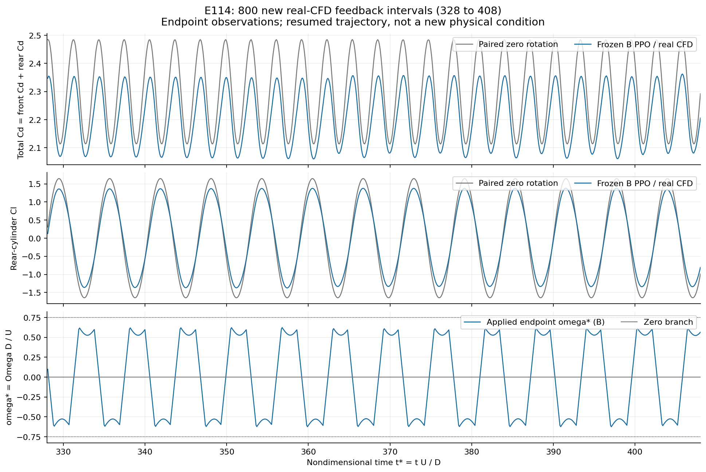

# 评估结果

以下总结截至 2026-10-07 的已保存证据。不同窗口分别报告，不混合训练损失、预测精度和真实控制效果。

## 真实 CFD 闭环

冻结 B 模型对应 E082 canonical PPO。无旋转和受控分支分别推进，在相同时间窗口比较真实受力。

| 实验与主窗口 | 减阻 | 后柱波动 RMS 比 | 平均升力偏置 | 物理标准 |
|---|---:|---:|---:|---|
| E095，运行 800 周期；主窗 t*=150–210 | 4.0091% | 0.817190 | 3.6366% | 通过 |
| E109，运行 800 周期；主窗 t*=268–328 | 3.9949% | 0.816588 | 2.8533% | 通过 |
| E114，800 周期，t*=328–408 | 4.1326% | 0.820771 | 1.2352% | 通过 |

E114 波动降低 17.9229%；四个连续 20 D/U∞ 子窗口及规定合并窗口也通过。E109 与 E114 是核验恢复前后的同一配对轨迹，累计 1,600 周期，不是两个独立统计重复。

证据：[E095](../research_records/CANONICAL_B01_REPRODUCTION_TERMINAL_REVIEW_20261007.md)、[E109](../research_records/P064_B_FUTURE_TIME_CFD_TERMINAL_REVIEW_20261007.md)、[E114 完整窗口表与独立审查](../research_records/P064_B_CONTINUATION_328_408_TERMINAL_REVIEW_20261007.md)。E114 结果 SHA256：`752b92d1063e51a8fb6a45ea539b173c3c5ffbd24c6a83255e0fa649f392063e`。

## 指标定义

令 CD=Cd前+Cd后；c 为受控分支，0 为无旋转对照。所有统计使用同一时间窗口。

- 减阻率：100×(1−mean(CD_c)/mean(CD_0))%。负值表示增阻。
- 升力波动：后柱 Cl 去均值 RMS，即 sqrt(mean((Cl−mean(Cl))²))。
- RMS 比：受控升力波动 / 对照升力波动；小于 1 表示降低。
- 平均偏置：100×abs(mean(Cl_c))/RMS(Cl_0 去均值)%。不是相对对照平均升力的变化率。

原标准为减阻 ≥2%、RMS 比 ≤1.05、偏置 ≤10%，没有放宽。t*=tU∞/D；80 D/U∞ 是流动物理时长，不是电脑运行 80 秒。

## 代理预测与候选评价

B 完整预测评估未通过；真实控制成功不改变这个失败。[完整预测审查](../research_records/P064_B_FORMAL_TERMINAL_REVIEW_20261006.md)

| B 原评估面板 | 实际指标 |
|---|---|
| validation10，100 步末端 | 速度相对 L2 误差 0.0435911；后柱 Cl MAE 0.0431183；总 Cd MAE 0.0112626 |
| 6 个受力统计分支，100 步预测末段的 62 个采样点 | Cd 均值误差 5/6 达标；Cl 波动误差 2/6 达标；Cl 均值误差 5/6 达标；三项同时仅 2/6 达标 |

四个旋转分支的升力波动预测均不达标。上述是代理预测标准，不是 CFD 控制的物理收益标准；末端指标也不能代替整段受力波动精度。

图为单个已保存样例的 CFD、预测与误差，不能代表总体精度。

Representative256 固定六窗口比较采用相同归一化、窗口与 highest/no-TF32 精度：

| 加权归一化预测误差 | B | 候选 | 相对变化 |
|---|---:|---:|---:|
| 单步 H1 | 0.00418103 | 0.00484234 | +15.8169% |
| 连续递推 AR100 | 0.00900292 | 0.01028767 | +14.2703% |

这些误差不是减阻百分比；训练拟合损失下降不代表此评价改善。候选未采用，没有继续其 PPO/CFD 验证。[同精度独立复算](../research_records/P064_REPRESENTATIVE256_FIXED_SIX_INDEPENDENT_REVIEW_20261007.md)

## MPC 短时试验

B-H5 MPC 完成 10 周期，配对减阻 −0.007886%，波动 RMS 比 0.983611。流程能执行，但短窗口没有有效减阻证据，也不宜推断长期表现。[MPC 审查](../research_records/P064_B_CAUSAL_HISTORY_H5_TERMINAL_REVIEW_20261007.md)

## 结果使用范围

支持限定工况下基本 PPO–CFD 闭环有效，不支持跨 Re 泛化、净节能、硬实时或实验迁移。早期窗口与部分 seed 的失败保留在归档中；上表不是所有试验成功的声明。完整研究仍需独立重复、简单控制比较、网格/时间步研究及执行器功率分析。

[全部结构化实验账本](../experiments/results.csv) · [完整图文报告](../research_records/PROJECT_FINAL_REPORT_20261007.md) · [历史证据目录](../research_records/)
